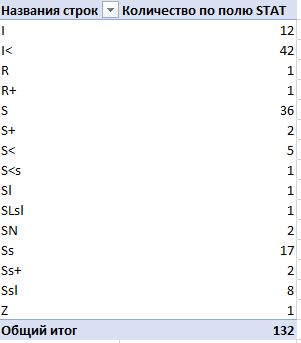

## Задание

1. Какой системный вызов делает команда `cd`? 
```shell
strace /bin/bash -c 'cd /tmp'
```
Анализиируем и находим системный вызов на смену директории  
```shell
chdir("/tmp")                           = 0
```

2. Попробуйте использовать команду `file` на объекты разных типов в файловой системе. Например:
    ```bash
    vagrant@netology1:~$ file /dev/tty
    /dev/tty: character special (5/0)
    vagrant@netology1:~$ file /dev/sda
    /dev/sda: block special (8/0)
    vagrant@netology1:~$ file /bin/bash
    /bin/bash: ELF 64-bit LSB shared object, x86-64
    ```
    Используя `strace` выясните, где находится база данных `file`, на основании которой она делает свои догадки.

Ответ:
По мануалу man file используются magic файлы, через strace успешное открытие файла magic осуществлено по адресу /usr/share/misc/magic.mgc
```shell
openat(AT_FDCWD, "/usr/share/misc/magic.mgc", O_RDONLY) = 3
```

3. Предположим, приложение пишет лог в текстовый файл. Этот файл оказался удален (deleted в lsof), однако возможности сигналом сказать приложению переоткрыть файлы или просто перезапустить приложение – нет. Так как приложение продолжает писать в удаленный файл, место на диске постепенно заканчивается. Основываясь на знаниях о перенаправлении потоков предложите способ обнуления открытого удаленного файла (чтобы освободить место на файловой системе).

Попробовал на примере файла syslog 
Нашёл процесс rsyslogd (pid 694) который пишет в данный файл /var/log/syslog
Удалил файл при помощи rm. 
```shell
root@vagrant:~# rm /var/log/syslog
root@vagrant:~# ls /var/log/syslog
ls: cannot access '/var/log/syslog': No such file or directory
root@vagrant:~# lsof -p 694
COMMAND  PID   USER   FD   TYPE             DEVICE SIZE/OFF       NODE NAME
...
rsyslogd 694 syslog    6u  unix 0xffffa0ff09b73800      0t0      23863 type=DGRAM
rsyslogd 694 syslog    7w   REG              253,0    65007    1050583 /var/log/syslog (deleted)
rsyslogd 694 syslog    8w   REG              253,0    57534    1049968 /var/log/auth.log
rsyslogd 694 syslog    9w   REG              253,0   405765    1050209 /var/log/kern.log
..
```
Установил и запустил nginx для примера, убедился что процесс rsyslogd продолжает логировать  в данный удаленный файл (с файловым дескриптором 7)
Почистил файл через перенаправление потока:
```shell
root@vagrant:~# echo '' > /proc/694/fd/7
```
Убедился что файл пустой через cat
```shell
root@vagrant:~# cat /proc/694/fd/7
root@vagrant:~#
```
Проверил, будет ли продолжать rsyslogd писать в него дальше, остановил сервис nginx для примера ,
```shell
root@vagrant:~# service nginx stop
root@vagrant:~# cat /proc/694/fd/7
Jan  3 14:33:45 vagrant systemd[1]: Stopping A high performance web server and a reverse proxy server...
Jan  3 14:33:45 vagrant systemd[1]: nginx.service: Succeeded.
Jan  3 14:33:45 vagrant systemd[1]: Stopped A high performance web server and a reverse proxy server.
```
Вывод rsyslogd продолжает снова писать в данный файл, однако старых данных нет они успешно зачищеныю.

4. Занимают ли зомби-процессы какие-то ресурсы в ОС (CPU, RAM, IO)?
Судя по wiki:
Зомби не занимают памяти (как процессы-сироты), но блокируют записи в таблице процессов, размер которой ограничен для каждого пользователя и системы в целом.

5. iovisor BCC есть утилита `opensnoop`:
    ```bash
    root@vagrant:~# dpkg -L bpfcc-tools | grep sbin/opensnoop
    /usr/sbin/opensnoop-bpfcc
    ```
    На какие файлы вы увидели вызовы группы `open` за первую секунду работы утилиты? Воспользуйтесь пакетом `bpfcc-tools` для Ubuntu 20.04. Дополнительные [сведения по установке](https://github.com/iovisor/bcc/blob/master/INSTALL.md).

Запустил
```shell

root@vagrant:~# /usr/sbin/opensnoop-bpfcc
PID    COMM               FD ERR PATH
1517   htop                3   0 /proc/meminfo
1517   htop                3   0 /proc/stat
1517   htop                3   0 /proc
1517   htop                4   0 /proc/1/task
1517   htop                4   0 /proc/1/statm
1517   htop                4   0 /proc/1/stat
1517   htop                4   0 /proc/2/task
1517   htop                4   0 /proc/2/statm
1517   htop                4   0 /proc/2/stat
1517   htop                4   0 /proc/3/task
1517   htop                4   0 /proc/3/statm
1517   htop                4   0 /proc/3/stat
1517   htop                4   0 /proc/4/task
1517   htop                4   0 /proc/4/statm
1517   htop                4   0 /proc/4/stat
1517   htop                4   0 /proc/6/task
1517   htop                4   0 /proc/6/statm
```

6. Какой системный вызов использует `uname -a`? Приведите цитату из man по этому системному вызову, где описывается альтернативное местоположение в `/proc`, где можно узнать версию ядра и релиз ОС.

Изучая strace обнаружил вызов функции: 
uname({sysname="Linux", nodename="vagrant", ...}) = 0

В manual ничего подобного про kernel нет:
```shell
root@vagrant:~# man uname |grep proc
       -p, --processor
              print the processor type (non-portable)
```

7. Чем отличается последовательность команд через `;` и через `&&` в bash? Например:
    ```bash
    root@netology1:~# test -d /tmp/some_dir; echo Hi
    Hi
    root@netology1:~# test -d /tmp/some_dir && echo Hi
    root@netology1:~#
    ```
    Есть ли смысл использовать в bash `&&`, если применить `set -e`?

; - обычный разделитель команд, все команды выполнятся в любом случае.
&& логический оператор И , следовательно echo Hi выполнится только в том случае если первая команда выполнится успешно, так как у меня нет такой директории
то первая команда выводит слово Hi. А второй вариант через && нет. 

```shell
root@vagrant:~# test -d /tmp/some_dir; echo Hi
Hi
root@vagrant:~# test -d /tmp/some_dir && echo Hi
```

Использовать && при set -e можно, а вот имеет ли смысла вопрос интересный, 
так как сразу же при ошибке выполнение прервется если команда слева вернёт не нулевой (успешный) статус.
то есть до выполнения команды справа && дело даже не дойдёт, поэтому наверное всё-таки нет смысла так делать.

Тестирование set -e на во втором случае выкинуло и не дошло до команды echo, даже написанной через; 
```shell
vagrant@vagrant:~$ test -d /tmp/some_dir
vagrant@vagrant:~$ set -e
vagrant@vagrant:~$ (test -d /tmp/some_dir;echo "Hi")
Connection to 127.0.0.1 closed.
```

8. Из каких опций состоит режим bash `set -euxo pipefail` и почему его хорошо было бы использовать в сценариях?

Полная статья на эту тему:
https://silentsokolov.github.io/safe-bash-sctipts

`-e` Немедленный выход, если команда завершается с ненулевым статусом. 
`-u` Проверяет инициализацию в переменных, если не будет скрипт завершится с ошибкой
`-x` Печатать команды и их аргументы по мере выполнения (аккуратнее надо будет с паролями в переменных) 
`-o option-pipefail` - если нужно убедиться, что все команды в пайпах завершились успешно (пример с ИЛИ | )

Полезно использовать во всех скриптах bash , так как, произойдёт как можно быстрый выход из скрипта при возникновении какой-то ошибки, 
это лучше, чем выполнять последующие команды, которые наверняка зависят от действия первых команд. 
Кроме этого будет информация о запускаемых командах и так проще будет найти ошибочную команду.
Также будут проверены все команды во всех пайпах.

В примере ниже, видно, что скрипт упал на проверке папки /tmp/some_dir
```shell
vagrant@vagrant:~$set -euxo pipefail
vagrant@vagrant:~$ (test -d /home; test -d /tmp/some_dir; echo "Hi");
+ test -d /home
+ test -d /tmp/some_dir
Connection to 127.0.0.1 closed.
```

9. Используя `-o stat` для `ps`, определите, какой наиболее часто встречающийся статус у процессов в системе. В `man ps` ознакомьтесь (`/PROCESS STATE CODES`) что значат дополнительные к основной заглавной буквы статуса процессов. Его можно не учитывать при расчете (считать S, Ss или Ssl равнозначными).

У меня вот так:
```shell
vagrant@vagrant:~$ ps -o stat
STAT
Ss
R+
```
Если выгнать все в текст, и подсчитать например в Excel , то результат что большинство  S - спящие прерываемые и ожидающие событий  



Описание всех кодов и обозначение дополнительных символов приведено ниже:
```shell
PROCESS STATE CODES
       Here are the different values that the s, stat and state output specifiers (header "STAT" or "S") will display to describe the state of a process:

               D    uninterruptible sleep (usually IO)
               I    Idle kernel thread
               R    running or runnable (on run queue)
               S    interruptible sleep (waiting for an event to complete)
               T    stopped by job control signal
               t    stopped by debugger during the tracing
               W    paging (not valid since the 2.6.xx kernel)
               X    dead (should never be seen)
               Z    defunct ("zombie") process, terminated but not reaped by its parent

       For BSD formats and when the stat keyword is used, additional characters may be displayed:

               <    high-priority (not nice to other users)
               N    low-priority (nice to other users)
               L    has pages locked into memory (for real-time and custom IO)
               s    is a session leader
               l    is multi-threaded (using CLONE_THREAD, like NPTL pthreads do)
               +    is in the foreground process group
```

