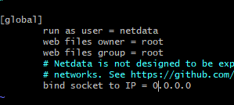
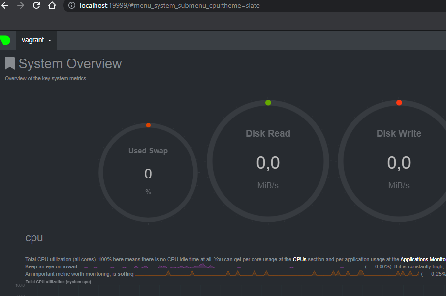
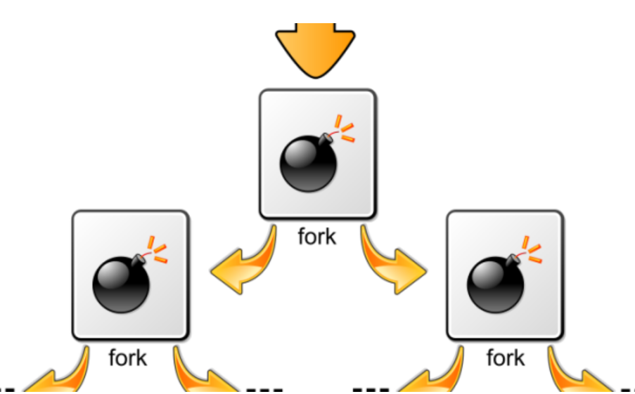

# Домашнее задание к занятию "3.4. Операционные системы. Лекция 2"
------

## Задание

1. На лекции мы познакомились с [node_exporter](https://github.com/prometheus/node_exporter/releases). В демонстрации его исполняемый файл запускался в background. Этого достаточно для демо, но не для настоящей production-системы, где процессы должны находиться под внешним управлением. Используя знания из лекции по systemd, создайте самостоятельно простой [unit-файл](https://www.freedesktop.org/software/systemd/man/systemd.service.html) для node_exporter:

```shell
# установка 
wget https://github.com/prometheus/node_exporter/releases/download/v1.5.0/node_exporter-1.5.0.linux-amd64.tar.gz
tar xvfz node_exporter-1.5.0.linux-amd64.tar.gz
# переношу в opt
mv node_exporter-1.5.0.linux-amd64 /opt/node_exporter
# формирую файл для environment с тестовой переменной
tee /etc/node_exporter.conf << EOF
FLAGS=--log.level=warn
EOF
# формирую systemd файл для node_exporter
tee /etc/systemd/system/node_exporter.service << EOF
[Unit]
Description=Node Exporter
 
[Service]
EnvironmentFile=/etc/node_exporter.conf
ExecStart=/opt/node_exporter/node_exporter \$FLAGS
 
[Install]
WantedBy=default.target
EOF
# запускаем сервис 
systemctl daemon-reload
systemctl enable node_exporter --now

```
В итоге, сервис помещён в автозагрузку 
опции-флаги могут быть добавлены через внешний файл /etc/node_exporter.conf
сервис успешно запускается, после перезагрузку автоматически поднимается
Флаг log.level=warn выставлен

```shell
root@sysadm-fs:~# systemctl status node_exporter
● node_exporter.service - Node Exporter
     Loaded: loaded (/etc/systemd/system/node_exporter.service; enabled; vendor preset: enabled)
     Active: active (running) since Sun 2023-01-15 17:30:38 UTC; 4s ago
   Main PID: 15751 (node_exporter)
      Tasks: 4 (limit: 2273)
     Memory: 2.7M
     CGroup: /system.slice/node_exporter.service
             └─15751 /opt/node_exporter/node_exporter --log.level=warn

Jan 15 17:30:38 sysadm-fs systemd[1]: Started Node Exporter.
Jan 15 17:30:38 sysadm-fs node_exporter[15751]: ts=2023-01-15T17:30:38.370Z caller=node_exporter.go:183 level=warn msg=
```


2. Ознакомьтесь с опциями node_exporter и выводом `/metrics` по-умолчанию. Приведите несколько опций, которые вы бы выбрали для базового мониторинга хоста по CPU, памяти, диску и сети.
Просматривал вот так:
```shell
curl -s http://localhost:9100/metrics | grep "node_" |grep cpu
curl -s http://localhost:9100/metrics | grep "node_" |grep memory
curl -s http://localhost:9100/metrics | grep "node_" |grep filesystem
curl -s http://localhost:9100/metrics | grep "node_" |grep network 
```
Выбрал бы как минимум следующие метрики, в интернете нашёл описание на английском:
node_cpu_seconds_total
The average amount of CPU time spent in system mode, per second, over the last minute (in seconds)

node_memory_MemFree_bytes
Free in bytes

node_filesystem_avail_bytes
The filesystem space available to non-root users (in bytes)

node_network_receive_bytes_total
The average network traffic received, per second, over the last minute (in bytes)

3. Установите в свою виртуальную машину [Netdata](https://github.com/netdata/netdata). Воспользуйтесь [готовыми пакетами](https://packagecloud.io/netdata/netdata/install) для установки (`sudo apt install -y netdata`). 
   
   После успешной установки:
    * в конфигурационном файле `/etc/netdata/netdata.conf` в секции [web] замените значение с localhost на `bind to = 0.0.0.0`,
    * добавьте в Vagrantfile проброс порта Netdata на свой локальный компьютер и сделайте `vagrant reload`:

    ```bash
    config.vm.network "forwarded_port", guest: 19999, host: 19999
    ```

    После успешной перезагрузки в браузере *на своем ПК* (не в виртуальной машине) вы должны суметь зайти на `localhost:19999`. Ознакомьтесь с метриками, которые по умолчанию собираются Netdata и с комментариями, которые даны к этим метрикам.

Установил, поменял конфиг (секция сейчас называется не web, а global)


пробросил порт, открыл в браузере своей машины 

Всё работает.


4. Можно ли по выводу `dmesg` понять, осознает ли ОС, что загружена не на настоящем оборудовании, а на системе виртуализации?

Да, можно, я грепнул слово virtual и нашёл сообщения, соответсвенно видно что работает виртуалиация от Oracle 
```shell
root@vagrant:~# dmesg  |grep virtual
[    0.002347] CPU MTRRs all blank - virtualized system.
[    0.066396] Booting paravirtualized kernel on KVM
[    5.071605] systemd[1]: Detected virtualization oracle.
```


5. Как настроен sysctl `fs.nr_open` на системе по-умолчанию? Определите, что означает этот параметр. Какой другой существующий лимит не позволит достичь такого числа (`ulimit --help`)?
root@vagrant:~# sysctl fs.nr_open
fs.nr_open = 1048576
это лимит на количество открытых дескрипторов для ядра 

ulimit -n
    -n        the maximum number of open file descriptors
Не может превышать fs.nr_open 

6. Запустите любой долгоживущий процесс (не `ls`, который отработает мгновенно, а, например, `sleep 1h`) в отдельном неймспейсе процессов; покажите, что ваш процесс работает под PID 1 через `nsenter`. Для простоты работайте в данном задании под root (`sudo -i`). Под обычным пользователем требуются дополнительные опции (`--map-root-user`) и т.д.
В 1 окне выполняю
```shell
unshare -f --pid --mount-proc sleep 1h
```
терминал блокируется на 1 час.

Во 2 ом окне:
```shell
root@vagrant:~# ps aux |grep sleep
root        3013  0.0  0.0   5480   580 pts/0    S+   19:11   0:00 unshare -f --pid --mount-proc sleep 1h
root        3014  0.0  0.0   5476   580 pts/0    S+   19:11   0:00 sleep 1h
root        3016  0.0  0.0   6432   720 pts/1    S+   19:12   0:00 grep --color=auto sleep

root@vagrant:~# nsenter --target 3014 --mount --uts --ipc --net --pid ps aux
USER         PID %CPU %MEM    VSZ   RSS TTY      STAT START   TIME COMMAND
root           1  0.0  0.0   5476   580 pts/0    S+   19:11   0:00 sleep 1h
root           2  0.0  0.0   8888  3232 pts/1    R+   19:14   0:00 ps aux
```

7. Найдите информацию о том, что такое `:(){ :|:& };:`. Запустите эту команду в своей виртуальной машине Vagrant с Ubuntu 20.04 (**это важно, поведение в других ОС не проверялось**). Некоторое время все будет "плохо", после чего (минуты) – ОС должна стабилизироваться. Вызов `dmesg` расскажет, какой механизм помог автоматической стабилизации.  
Как настроен этот механизм по-умолчанию, и как изменить число процессов, которое можно создать в сессии?

Описание и рисунок взял отсюда
https://linux-notes.org/sozdanie-fork-bomb-v-unix-linux/
```shell
:() — Определение функции.
{  — Открытие функции.
:|: — Далее, загружает копию функции «:» в память тем самым, будет вызывать само себя с использованием техники программирования ( так называемая рекурсия) и передает результат на другой вызов функции.
‘:’ — Худшая часть — функция, вызываемая два раза, чтобы «бомбить» вашу систему.
& — Помещает вызов функции в фоновом режиме, чтобы fork (дочерний процесс) не мог «умереть» вообще, тем самым это начнет есть системные ресурсы.
} — Закрытие функции.
; — Завершите определение функции. Т.е является разделителем команд, (такой как и &&).
: — Запускает функцию которая порождает fork bomb().
```



```shell
root@vagrant:~# dmesg |tail
[  861.333525] audit: type=1400 audit(1673721495.557:61): apparmor="STATUS" operation="profile_replace" info="same as current profile, skipping" profile="unconfined" name="/snap/snapd/17950/usr/lib/snapd/snap-confine//mount-namespace-capture-helper" pid=2398 comm="apparmor_parser"
[  861.405967] audit: type=1400 audit(1673721495.629:62): apparmor="STATUS" operation="profile_replace" profile="unconfined" name="snap.lxd.buginfo" pid=2402 comm="apparmor_parser"
[  861.409811] audit: type=1400 audit(1673721495.633:63): apparmor="STATUS" operation="profile_replace" profile="unconfined" name="snap.lxd.benchmark" pid=2401 comm="apparmor_parser"
[  861.414385] audit: type=1400 audit(1673721495.637:64): apparmor="STATUS" operation="profile_replace" profile="unconfined" name="snap.lxd.activate" pid=2400 comm="apparmor_parser"
[  861.417693] audit: type=1400 audit(1673721495.641:65): apparmor="STATUS" operation="profile_replace" profile="unconfined" name="snap.lxd.check-kernel" pid=2403 comm="apparmor_parser"
[  861.475443] audit: type=1400 audit(1673721495.697:66): apparmor="STATUS" operation="profile_replace" profile="unconfined" name="snap.lxd.hook.install" pid=2406 comm="apparmor_parser"
[  861.492115] audit: type=1400 audit(1673721495.713:67): apparmor="STATUS" operation="profile_replace" profile="unconfined" name="snap.lxd.hook.remove" pid=2407 comm="apparmor_parser"
[  861.503696] audit: type=1400 audit(1673721495.725:68): apparmor="STATUS" operation="profile_replace" profile="unconfined" name="snap.lxd.daemon" pid=2404 comm="apparmor_parser"
[  861.514094] audit: type=1400 audit(1673721495.737:69): apparmor="STATUS" operation="profile_replace" profile="unconfined" name="snap.lxd.hook.configure" pid=2405 comm="apparmor_parser"
[ 3308.758666] cgroup: fork rejected by pids controller in /user.slice/user-1000.slice/session-5.scope
```
Это fork бомба , fork rejected by pids controller это строчка стабилизации системы, видимо на основе данных файлов и ограничений произошла остановка создания новых копий
https://ru.wikipedia.org/wiki/Fork-%D0%B1%D0%BE%D0%BC%D0%B1%D0%B0

Число процессов, которые можно создать в сессии, возможно изменить командой ulimit -u 
соответственно можно ограничить возможное действия fork бомбы
