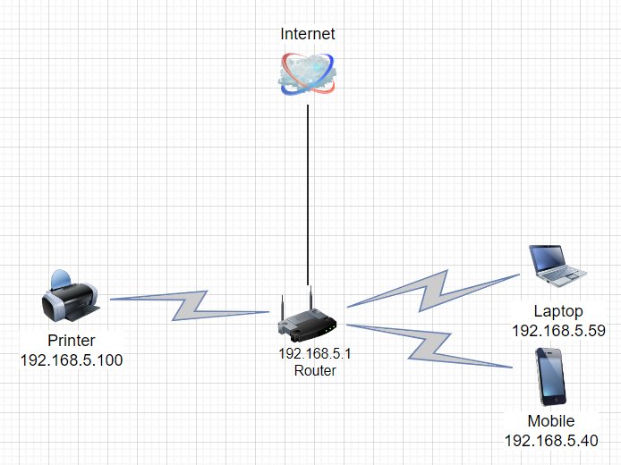

# Домашнее задание к занятию "Компьютерные сети, лекция 3"

### Цель задания

В результате выполнения этого задания вы:

1. На практике познакомитесь с маршрутизацией в сетях, что позволит понять устройство больших корпоративных сетей и интернета.
2. Проверите TCP/UDP соединения на хосте (это обычный этап отладки сетевых проблем).
3. Построите сетевую диаграмму.


### Инструменты/ дополнительные материалы, которые пригодятся для выполнения задания

1. [Зачем нужны dummy интерфейсы](https://tldp.org/LDP/nag/node72.html)

------

## Задание

1. Подключитесь к публичному маршрутизатору в интернет. Найдите маршрут к вашему публичному IP
```
telnet route-views.routeviews.org
Username: rviews
show ip route x.x.x.x/32
show bgp x.x.x.x/32
```
Ответ:
Подключился посмотрел , кое что спрятал под XXX так как задание выкладывается в открытый репозиторий github 

```shell
root@sysadm-fs:~#
root@sysadm-fs:~#
root@sysadm-fs:~# telnet route-views.routeviews.org
Trying 128.223.51.103...
Connected to route-views.routeviews.org.
Escape character is '^]'.
C
**********************************************************************

                    RouteViews BGP Route Viewer
                    route-views.routeviews.org

 route views data is archived on http://archive.routeviews.org

 This hardware is part of a grant by the NSF.
 Please contact help@routeviews.org if you have questions, or
 if you wish to contribute your view.

 This router has views of full routing tables from several ASes.
 The list of peers is located at http://www.routeviews.org/peers
 in route-views.oregon-ix.net.txt

 NOTE: The hardware was upgraded in August 2014.  If you are seeing
 the error message, "no default Kerberos realm", you may want to
 in Mac OS X add "default unset autologin" to your ~/.telnetrc

 To login, use the username "rviews".

 **********************************************************************

User Access Verification

Username: rviews
route-views>show ip route 157.97.xxx.XX/32
                                       ^
% Invalid input detected at '^' marker.

route-views>show ip route 157.97.xxx.XX
Routing entry for 157.97.xxx.0/24
  Known via "bgp 6447", distance 20, metric 0
  Tag 3356, type external
  Last update from 4.68.4.46 4w1d ago
  Routing Descriptor Blocks:
  * 4.68.4.46, from 4.68.4.46, 4w1d ago
      Route metric is 0, traffic share count is 1
      AS Hops 2
      Route tag 3356
      MPLS label: none
route-views>show bgp 157.97.xxx.XX
BGP routing table entry for 157.97.xxx.0/24, version 2641190864
Paths: (19 available, best #13, table default)
  Not advertised to any peer
  Refresh Epoch 1
  3333 1103 9009
    193.0.0.56 from 193.0.0.56 (193.0.0.56)
      Origin IGP, localpref 100, valid, external
      Community: 9009:100 9009:40000 9009:50045 9009:55160 65000:52114 65000:65049
      path 7FE0CC4920F8 RPKI State not found
      rx pathid: 0, tx pathid: 0
  Refresh Epoch 1
  20912 3257 3356 9009
    212.66.96.126 from 212.66.96.126 (212.66.96.126)
      Origin IGP, localpref 100, valid, external
      Community: 3257:8070 3257:30515 3257:50001 3257:53900 3257:53902 20912:65004
      path 7FE04ACA08C0 RPKI State not found
      rx pathid: 0, tx pathid: 0
  Refresh Epoch 1
  6939 3356 9009
    64.71.137.241 from 64.71.137.241 (216.218.253.53)
      Origin IGP, localpref 100, valid, external
      path 7FE02CC1DCC0 RPKI State not found
      rx pathid: 0, tx pathid: 0
  Refresh Epoch 1
  8283 9009
    94.142.247.3 from 94.142.247.3 (94.142.247.3)
      Origin IGP, metric 0, localpref 100, valid, external
      Community: 8283:1 8283:101 9009:100 9009:40000 9009:50045 9009:55160 65000:52114 65000:65049
      unknown transitive attribute: flag 0xE0 type 0x20 length 0x24
        value 0000 205B 0000 0000 0000 0001 0000 205B
              0000 0005 0000 0001 0000 205B 0000 0008
              0000 0040
      path 7FE0CA204840 RPKI State not found
      rx pathid: 0, tx pathid: 0
  Refresh Epoch 1
  7018 3356 9009
    12.0.1.63 from 12.0.1.63 (12.0.1.63)
      Origin IGP, localpref 100, valid, external
      Community: 7018:5000 7018:37232
      path 7FE17402C000 RPKI State not found
      rx pathid: 0, tx pathid: 0
  Refresh Epoch 1
  3257 3356 9009
    89.149.178.10 from 89.149.178.10 (213.200.83.26)
      Origin IGP, metric 10, localpref 100, valid, external
      Community: 3257:8794 3257:30043 3257:50001 3257:54900 3257:54901
      path 7FE0DC516E08 RPKI State not found
      rx pathid: 0, tx pathid: 0
  Refresh Epoch 1
  49788 1299 9009
    91.218.184.60 from 91.218.184.60 (91.218.184.60)
      Origin IGP, localpref 100, valid, external
      Community: 1299:30000
      Extended Community: 0x43:100:1
      path 7FE0BFDAE110 RPKI State not found
      rx pathid: 0, tx pathid: 0
  Refresh Epoch 1
  3561 3910 3356 9009
    206.24.210.80 from 206.24.210.80 (206.24.210.80)
      Origin IGP, localpref 100, valid, external
      path 7FE00EF903E8 RPKI State not found
      rx pathid: 0, tx pathid: 0
  Refresh Epoch 1
  3549 3356 9009
    208.51.134.254 from 208.51.134.254 (67.16.168.191)
      Origin IGP, metric 0, localpref 100, valid, external
      Community: 3356:2 3356:22 3356:100 3356:123 3356:510 3356:903 3356:2091 3549:2581 3549:30840 9009:100 9009:40000 9009:50045 9009:55160
      path 7FE0CF3571E0 RPKI State not found
      rx pathid: 0, tx pathid: 0
  Refresh Epoch 1
  3267 1299 9009
    194.85.40.15 from 194.85.40.15 (185.141.126.1)
      Origin IGP, metric 0, localpref 100, valid, external
      path 7FE0E33505A8 RPKI State not found
      rx pathid: 0, tx pathid: 0
  Refresh Epoch 1
  4901 6079 3356 9009
    162.250.137.254 from 162.250.137.254 (162.250.137.254)
      Origin IGP, localpref 100, valid, external
      Community: 65000:10100 65000:10300 65000:10400
      path 7FE0B0104780 RPKI State not found
      rx pathid: 0, tx pathid: 0
  Refresh Epoch 1
  101 3356 9009
    209.124.176.223 from 209.124.176.223 (209.124.176.223)
      Origin IGP, localpref 100, valid, external
      Community: 101:20100 101:20110 101:22100 3356:2 3356:22 3356:100 3356:123 3356:510 3356:903 3356:2091 9009:100 9009:40000 9009:50045 9009:55160
      Extended Community: RT:101:22100
      path 7FE116C94150 RPKI State not found
      rx pathid: 0, tx pathid: 0
  Refresh Epoch 1
  3356 9009
    4.68.4.46 from 4.68.4.46 (4.69.184.201)
      Origin IGP, metric 0, localpref 100, valid, external, best
      Community: 3356:2 3356:22 3356:100 3356:123 3356:510 3356:903 3356:2091 9009:100 9009:40000 9009:50045 9009:55160
      path 7FE098298B58 RPKI State not found
      rx pathid: 0, tx pathid: 0x0
  Refresh Epoch 1
  57866 1299 9009
    37.139.139.17 from 37.139.139.17 (37.139.139.17)
      Origin IGP, metric 0, localpref 100, valid, external
      Community: 1299:30000 57866:100 65100:1299 65103:3 65104:31
      unknown transitive attribute: flag 0xE0 type 0x20 length 0x30
        value 0000 E20A 0000 0064 0000 0513 0000 E20A
              0000 0065 0000 0064 0000 E20A 0000 0067
              0000 0003 0000 E20A 0000 0068 0000 001F

      path 7FE0A2B8C2D0 RPKI State not found
      rx pathid: 0, tx pathid: 0
  Refresh Epoch 2
  2497 3356 9009
    202.232.0.2 from 202.232.0.2 (58.138.96.254)
      Origin IGP, localpref 100, valid, external
      path 7FE0DC95F2A8 RPKI State not found
      rx pathid: 0, tx pathid: 0
  Refresh Epoch 1
  20130 6939 3356 9009
    140.192.8.16 from 140.192.8.16 (140.192.8.16)
      Origin IGP, localpref 100, valid, external
      path 7FE13B92C118 RPKI State not found
      rx pathid: 0, tx pathid: 0
  Refresh Epoch 1
  3303 3356 9009
    217.192.89.50 from 217.192.89.50 (138.187.128.158)
      Origin IGP, localpref 100, valid, external
      Community: 3303:1004 3303:1007 3303:3067 3356:2 3356:22 3356:100 3356:123 3356:510 3356:903 3356:2091 3356:10457 9009:100 9009:40000 9009:50045 9009:55160
      path 7FE0BA2F2D68 RPKI State not found
      rx pathid: 0, tx pathid: 0
  Refresh Epoch 1
  852 3356 9009
    154.11.12.212 from 154.11.12.212 (96.1.209.43)
      Origin IGP, metric 0, localpref 100, valid, external
      path 7FE00BE16300 RPKI State not found
      rx pathid: 0, tx pathid: 0
  Refresh Epoch 1
  1351 6939 3356 9009
    132.198.255.253 from 132.198.255.253 (132.198.255.253)
      Origin IGP, localpref 100, valid, external
      path 7FE0B0A5F318 RPKI State not found
      rx pathid: 0, tx pathid: 0
route-views>
route-views>
route-views>
route-views>
route-views>
route-views>
route-views>
route-views>
route-views>
```

2. Создайте dummy0 интерфейс в Ubuntu. Добавьте несколько статических маршрутов. Проверьте таблицу маршрутизации.

https://ixnfo.com/sozdanie-dummy-interfeysov-v-linux.html

```shell
vagrant@sysadm-fs:~$ sudo modprobe -v dummy numdummies=2
insmod /lib/modules/5.4.0-135-generic/kernel/drivers/net/dummy.ko numdummies=0 numdummies=2
vagrant@sysadm-fs:~$
vagrant@sysadm-fs:~$ lsmod | grep dummy
dummy                  16384  0
vagrant@sysadm-fs:~$
vagrant@sysadm-fs:~$ ifconfig -a | grep dummy
-bash: ifconfig: command not found
vagrant@sysadm-fs:~$ ip a show type dummy
4: dummy0: <BROADCAST,NOARP> mtu 1500 qdisc noop state DOWN group default qlen 1000
    link/ether a6:e1:16:3b:e9:e0 brd ff:ff:ff:ff:ff:ff
5: dummy1: <BROADCAST,NOARP> mtu 1500 qdisc noop state DOWN group default qlen 1000
    link/ether 2a:c3:6d:97:92:c9 brd ff:ff:ff:ff:ff:ff
vagrant@sysadm-fs:~$


vagrant@sysadm-fs:~$ ip -br route
default via 10.0.2.2 dev eth0 proto dhcp src 10.0.2.15 metric 100
default via 192.168.5.1 dev eth1 proto dhcp src 192.168.5.199 metric 100
10.0.2.0/24 dev eth0 proto kernel scope link src 10.0.2.15
10.0.2.2 dev eth0 proto dhcp scope link src 10.0.2.15 metric 100
192.168.5.0/24 dev eth1 proto kernel scope link src 192.168.5.199
192.168.5.1 dev eth1 proto dhcp scope link src 192.168.5.199 metric 100
vagrant@sysadm-fs:~$ sudo ip route add 192.168.6.0/24 dev eth0
vagrant@sysadm-fs:~$ ip -br route
default via 10.0.2.2 dev eth0 proto dhcp src 10.0.2.15 metric 100
default via 192.168.5.1 dev eth1 proto dhcp src 192.168.5.199 metric 100
10.0.2.0/24 dev eth0 proto kernel scope link src 10.0.2.15
10.0.2.2 dev eth0 proto dhcp scope link src 10.0.2.15 metric 100
192.168.5.0/24 dev eth1 proto kernel scope link src 192.168.5.199
192.168.5.1 dev eth1 proto dhcp scope link src 192.168.5.199 metric 100
192.168.6.0/24 dev eth0 scope link
```

3. Проверьте открытые TCP порты в Ubuntu, какие протоколы и приложения используют эти порты? Приведите несколько примеров.
```shell
State  Recv-Q Send-Q Local Address:Port Peer Address:Port Process
LISTEN 0      4096   127.0.0.53%lo:53        0.0.0.0:*     users:(("systemd-resolve",pid=620,fd=13))
LISTEN 0      128          0.0.0.0:22        0.0.0.0:*     users:(("sshd",pid=705,fd=3))
LISTEN 0      128             [::]:22           [::]:*     users:(("sshd",pid=705,fd=4))
vagrant@sysadm-fs:~$
```

53 - DNS 
22 - SSH 

4. Проверьте используемые UDP сокеты в Ubuntu, какие протоколы и приложения используют эти порты?
```shell
vagrant@sysadm-fs:~$ sudo ss -unap
State       Recv-Q      Send-Q                 Local Address:Port             Peer Address:Port      Process
UNCONN      0           0                      127.0.0.53%lo:53                    0.0.0.0:*          users:(("systemd-resolve",pid=620,fd=12))
UNCONN      0           0                 192.168.5.199%eth1:68                    0.0.0.0:*          users:(("systemd-network",pid=618,fd=20))
UNCONN      0           0                     10.0.2.15%eth0:68                    0.0.0.0:*          users:(("systemd-network",pid=618,fd=22))
```
53 - DNS по UDP
68 - использует DHCP


5. Используя diagrams.net, создайте L3 диаграмму вашей домашней сети или любой другой сети, с которой вы работали. 



## Задание для самостоятельной отработки* (необязательно к выполнению)
6. Установите Nginx, настройте в режиме балансировщика TCP или UDP.
7. Установите bird2, настройте динамический протокол маршрутизации RIP.
8. Установите Netbox, создайте несколько IP префиксов, используя curl проверьте работу API.
