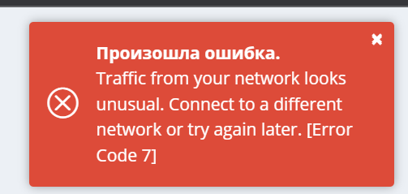

# Домашнее задание к занятию «Элементы безопасности информационных систем»


### Цель задания

В результате выполнения задания вы: 

* настроите парольный менеджер, что позволит не использовать один и тот же пароль на все ресурсы и удобно работать со множеством паролей;
* настроите веб-сервер на работу с HTTPS. Сегодня HTTPS является стандартом в интернете. Понимание сути работы центра сертификации, цепочки сертификатов позволит сконфигурировать SSH-клиент на работу с разными серверами по-разному, что даёт большую гибкость SSH-соединений. Например, к некоторым серверам мы можем обращаться по SSH через приложения, где недоступен ввод пароля;
* поработаете со сбором и анализом трафика, которые необходимы для отладки сетевых проблем.


### Инструкция к заданию

1. Создайте .md-файл для ответов на задания в своём репозитории, после выполнения прикрепите ссылку на него в личном кабинете.
2. Любые вопросы по выполнению заданий задавайте в чате учебной группы или в разделе «Вопросы по заданию» в личном кабинете.

### Дополнительные материалы для выполнения задания

1. [SSL + Apache2](https://digitalocean.com/community/tutorials/how-to-create-a-self-signed-ssl-certificate-for-apache-in-ubuntu-20-04).

------

## Задание

1. Установите плагин Bitwarden для браузера. Зарегестрируйтесь и сохраните несколько паролей.

Ответ: 

У меня проблема ему не нравится моя сеть, вот такая ошибка:



В целом что это такое и как с этим работать мне абсолютно понятно.

2. Установите Google Authenticator на мобильный телефон. Настройте вход в Bitwarden-акаунт через Google Authenticator OTP.

Ответ:
  
В связи с невозможностью настроить Bitwarden для моей сети (возможно что блокировка сервисом IP РФ) настроить двухфакторную авторизацию не получается, но с Google Authentificator и аналогичными решениями от Microsoft и Cisco уже работал.

3. Установите apache2, сгенерируйте самоподписанный сертификат, настройте тестовый сайт для работы по HTTPS.

Ответ:

Ориентируюсь на эту инструкцию, но там не всё корректно:
https://www.digitalocean.com/community/tutorials/how-to-create-a-self-signed-ssl-certificate-for-apache-in-ubuntu-16-04

Полное рабочее решение:

```sh
sudo apt install apache2 -y
sudo openssl req -x509 -nodes -newkey rsa:2048 -keyout /etc/ssl/private/apache-selfsigned.key -out /etc/ssl/certs/apache-selfsigned.crt
sudo nano /etc/apache2/sites-available/test.conf
```

Test site configuration /etc/apache2/sites-available/test.foo.conf:
```
<VirtualHost *:443>
   ServerName test.foo
   DocumentRoot /var/www/test.foo

   SSLEngine on
   SSLCertificateFile /etc/ssl/certs/apache-selfsigned.crt
   SSLCertificateKeyFile /etc/ssl/private/apache-selfsigned.key
</VirtualHost>
```

```sh
sudo mkdir /var/www/test.foo
sudo nano /var/www/test.foo/index.html
```
```index.html
<h1>it worked!</h1>
```

```sh
sudo a2ensite test.foo.conf
sudo a2enmod ssl
sudo apache2ctl configtest
sudo systemctl reload apache2
```

Проверка что работает тестовый веб сайт на Apache:
```
vagrant@sysadm-fs:~$ curl -k https://127.0.0.1
<h1>it worked!</h1>
```

Проверка сертификата:
```
vagrant@sysadm-fs:~$ curl -k -vvI https://127.0.0.1
*   Trying 127.0.0.1:443...
* TCP_NODELAY set
* Connected to 127.0.0.1 (127.0.0.1) port 443 (#0)
* ALPN, offering h2
* ALPN, offering http/1.1
* successfully set certificate verify locations:
*   CAfile: /etc/ssl/certs/ca-certificates.crt
  CApath: /etc/ssl/certs
* TLSv1.3 (OUT), TLS handshake, Client hello (1):
* TLSv1.3 (IN), TLS handshake, Server hello (2):
* TLSv1.3 (IN), TLS handshake, Encrypted Extensions (8):
* TLSv1.3 (IN), TLS handshake, Certificate (11):
* TLSv1.3 (IN), TLS handshake, CERT verify (15):
* TLSv1.3 (IN), TLS handshake, Finished (20):
* TLSv1.3 (OUT), TLS change cipher, Change cipher spec (1):
* TLSv1.3 (OUT), TLS handshake, Finished (20):
* SSL connection using TLSv1.3 / TLS_AES_256_GCM_SHA384
* ALPN, server accepted to use http/1.1
* Server certificate:
*  subject: C=AU; ST=Some-State; O=Internet Widgits Pty Ltd
*  start date: Mar 13 14:26:36 2023 GMT
*  expire date: Apr 12 14:26:36 2023 GMT
*  issuer: C=AU; ST=Some-State; O=Internet Widgits Pty Ltd
*  SSL certificate verify result: self signed certificate (18), continuing anyway.
> HEAD / HTTP/1.1
> Host: 127.0.0.1
> User-Agent: curl/7.68.0
> Accept: */*
>
* TLSv1.3 (IN), TLS handshake, Newsession Ticket (4):
* TLSv1.3 (IN), TLS handshake, Newsession Ticket (4):
* old SSL session ID is stale, removing
* Mark bundle as not supporting multiuse
< HTTP/1.1 200 OK
HTTP/1.1 200 OK
< Date: Mon, 13 Mar 2023 14:32:40 GMT
Date: Mon, 13 Mar 2023 14:32:40 GMT
< Server: Apache/2.4.41 (Ubuntu)
Server: Apache/2.4.41 (Ubuntu)
< Last-Modified: Mon, 13 Mar 2023 14:27:27 GMT
Last-Modified: Mon, 13 Mar 2023 14:27:27 GMT
< ETag: "14-5f6c8e914f36d"
ETag: "14-5f6c8e914f36d"
< Accept-Ranges: bytes
Accept-Ranges: bytes
< Content-Length: 20
Content-Length: 20
< Content-Type: text/html
Content-Type: text/html
```


4. Проверьте на TLS-уязвимости произвольный сайт в интернете (кроме сайтов МВД, ФСБ, МинОбр, НацБанк, РосКосмос, РосАтом, РосНАНО и любых госкомпаний, объектов КИИ, ВПК и т. п.).

```
# установил докер
sudo curl -sSL get.docker.com |sh
# запустил докер образ https://github.com/drwetter/testssl.sh
sudo docker run --rm -ti  drwetter/testssl.sh -U --sneaky https://google.ru
```

Результат:
```
###########################################################
    testssl.sh       3.2rc2 from https://testssl.sh/dev/

      This program is free software. Distribution and
             modification under GPLv2 permitted.
      USAGE w/o ANY WARRANTY. USE IT AT YOUR OWN RISK!

       Please file bugs @ https://testssl.sh/bugs/

###########################################################

 Using "OpenSSL 1.0.2-bad (1.0.2k-dev)" [~179 ciphers]
 on 788bb29789a4:/home/testssl/bin/openssl.Linux.x86_64
 (built: "Sep  1 14:03:44 2022", platform: "linux-x86_64")


 Start 2023-03-13 14:36:24        -->> 142.251.39.99:443 (google.ru) <<--

 Further IP addresses:   108.177.14.94 2a00:1450:400e:802::2003
 rDNS (142.251.39.99):   ams15s48-in-f3.1e100.net.
 Service detected:       HTTP


 Testing vulnerabilities

 Heartbleed (CVE-2014-0160)                not vulnerable (OK), no heartbeat extension
 CCS (CVE-2014-0224)                       not vulnerable (OK)
 Ticketbleed (CVE-2016-9244), experiment.  not vulnerable (OK)
 ROBOT                                     not vulnerable (OK)
 Secure Renegotiation (RFC 5746)           supported (OK)
 Secure Client-Initiated Renegotiation     not vulnerable (OK)
 CRIME, TLS (CVE-2012-4929)                not vulnerable (OK)
 BREACH (CVE-2013-3587)                    no gzip/deflate/compress/br HTTP compression (OK)  - only supplied "/" tested
 POODLE, SSL (CVE-2014-3566)               not vulnerable (OK)
 TLS_FALLBACK_SCSV (RFC 7507)              Downgrade attack prevention supported (OK)
 SWEET32 (CVE-2016-2183, CVE-2016-6329)    VULNERABLE, uses 64 bit block ciphers
 FREAK (CVE-2015-0204)                     not vulnerable (OK)
 DROWN (CVE-2016-0800, CVE-2016-0703)      not vulnerable on this host and port (OK)
                                           make sure you don't use this certificate elsewhere with SSLv2 enabled services, see
                                           https://search.censys.io/search?resource=hosts&virtual_hosts=INCLUDE&q=493A27F9937B56A232ED95F7ACEB464E914CB3403D316293E6B3A0DB15269AED
 LOGJAM (CVE-2015-4000), experimental      not vulnerable (OK): no DH EXPORT ciphers, no DH key detected with <= TLS 1.2
 BEAST (CVE-2011-3389)                     TLS1: ECDHE-ECDSA-AES128-SHA ECDHE-ECDSA-AES256-SHA ECDHE-RSA-AES128-SHA ECDHE-RSA-AES256-SHA AES128-SHA AES256-SHA DES-CBC3-SHA
                                           VULNERABLE -- but also supports higher protocols  TLSv1.1 TLSv1.2 (likely mitigated)
 LUCKY13 (CVE-2013-0169), experimental     potentially VULNERABLE, uses cipher block chaining (CBC) ciphers with TLS. Check patches
 Winshock (CVE-2014-6321), experimental    not vulnerable (OK)
 RC4 (CVE-2013-2566, CVE-2015-2808)        no RC4 ciphers detected (OK)
```

5. Установите на Ubuntu SSH-сервер, сгенерируйте новый приватный ключ. Скопируйте свой публичный ключ на другой сервер. Подключитесь к серверу по SSH-ключу.

Ответ:
Для этого поднял в vagrant ещё одну машину (debian) с приватной локальной сетью
На данной машине добавил пользователя admin и включил возможность логиниться с паролем, для того чтобы была возможность поставить свой ключ. 

Действия на Debian:
```sh
sudo adduser --quiet --disabled-password --gecos "" admin
echo "admin:password" | sudo chpasswd; sudo usermod -aG sudo admin
sudo usermod -aG adm admin
sudo sed -i 's/PasswordAuthentication no/PasswordAuthentication yes/g' /etc/ssh/sshd_config
sudo service sshd restart
```

Действия на Ubuntu:
```sh
vagrant@sysadm-fs:~$ ssh-keygen
Generating public/private rsa key pair.
Enter file in which to save the key (/home/vagrant/.ssh/id_rsa):
/home/vagrant/.ssh/id_rsa already exists.
Overwrite (y/n)? y
Enter passphrase (empty for no passphrase):
Enter same passphrase again:
Your identification has been saved in /home/vagrant/.ssh/id_rsa
Your public key has been saved in /home/vagrant/.ssh/id_rsa.pub
The key fingerprint is:
..

# Копирую ключ на Debian
ssh-copy-id admin@192.168.5.230
# Подключаюсь по ключу на другой сервер (Debian)
ssh 192.168.5.230 -l admin
```
На Debian, выключаю возможность подключения по паролю, останется возможность подключения только по ключу
```sh
sudo sed -i 's/PasswordAuthentication yes/PasswordAuthentication no/g' /etc/ssh/sshd_config
sudo service sshd restart
```


6. Переименуйте файлы ключей из задания 5. Настройте файл конфигурации SSH-клиента так, чтобы вход на удалённый сервер осуществлялся по имени сервера.

```
sudo mv ~/.ssh/id_rsa.pub ~/.ssh/boo.pub
sudo mv ~/.ssh/id_rsa ~/.ssh/boo
sudo mkdir -p ~/.ssh && sudo chmod 700 ~/.ssh
sudo touch ~/.ssh/config && sudo chmod 600 ~/.ssh/config
sudo vi ~/.ssh/config
```

Файл config
```
Host debian
        HostName 192.168.5.230
        User admin
        Port 22
        IdentityFile ~/.ssh/boo
#StrictHostKeyChecking no        
```


7. Соберите дамп трафика утилитой tcpdump в формате pcap, 100 пакетов. Откройте файл pcap в Wireshark.
Ответ:

```sh
 tcpdump -c 100 -w dump100.pcap
```


*В качестве решения приложите: скриншоты, выполняемые команды, комментарии (при необходимости).*

---

## Задание со звёздочкой* 

Это самостоятельное задание, его выполнение необязательно.

8. Просканируйте хост scanme.nmap.org. Какие сервисы запущены?

9. Установите и настройте фаервол UFW на веб-сервер из задания 3. Откройте доступ снаружи только к портам 22, 80, 443.

----

### Правила приёма домашнего задания

В личном кабинете отправлена ссылка на .md-файл в вашем репозитории.

-----

### Критерии оценки

Зачёт:

* выполнены все задания;
* ответы даны в развёрнутой форме;
* приложены соответствующие скриншоты и файлы проекта;
* в выполненных заданиях нет противоречий и нарушения логики.

На доработку:

* задание выполнено частично или не выполнено вообще;
* в логике выполнения заданий есть противоречия и существенные недостатки.  

Обязательными являются задачи без звёздочки. Их выполнение необходимо для получения зачёта и диплома о профессиональной переподготовке.

Задачи со звёздочкой (*) являются дополнительными или задачами повышенной сложности. Они необязательные, но их выполнение поможет лучше разобраться в теме.