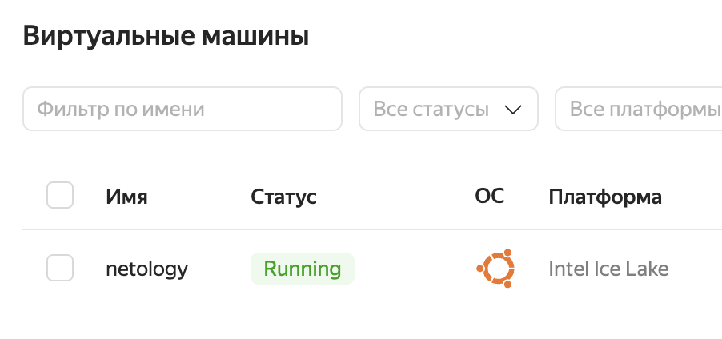
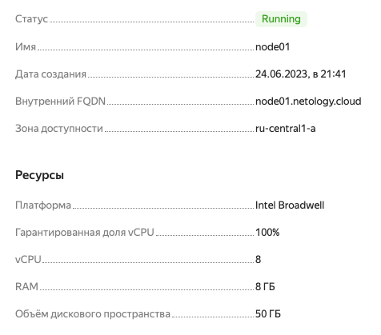
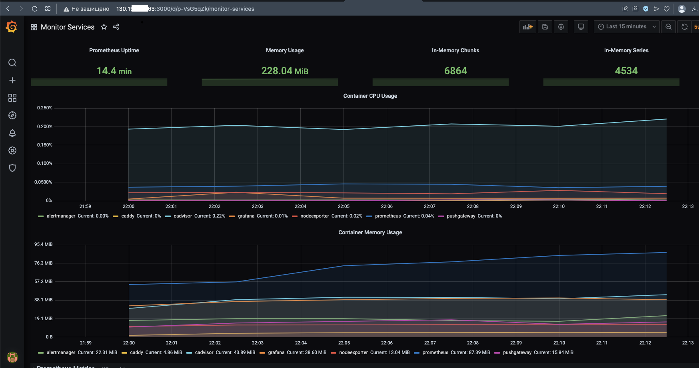

# Домашнее задание к занятию 4. «Оркестрация группой Docker-контейнеров на примере Docker Compose»

---

## Задача 1

Создайте собственный образ любой операционной системы (например ubuntu-20.04) с помощью Packer ([инструкция](https://cloud.yandex.ru/docs/tutorials/infrastructure-management/packer-quickstart)).

Чтобы получить зачёт, вам нужно предоставить скриншот страницы с созданным образом из личного кабинета YandexCloud.
Ответ: 
Все сделал по инструкции , поставил обе программы, прописаны все пути. руки тоже правильно растут , обе программы доступны  из любого места доступны, 
но при запуске получают ошибку о том что неизвестен builder yandex

```sh
mac@MacBook-Pro-mac yc % yc version
Yandex Cloud CLI 0.107.0 darwin/amd64
mac@MacBook-Pro-mac yc % packer version
Packer v1.9.1
mac@MacBook-Pro-mac yc % packer build image.json 
Error: Failed to initialize build "yandex"

error initializing builder 'yandex': Unknown builder yandex
```

images.json выглядит следующим образом, убрал чувствительные данные:

```sh
{
    "builders": [
      {
        "type":      "yandex",
        "token":     "mytoken0auth",
        "folder_id": "myfolderid",
        "zone":      "ru-central1-a",
  
        "image_name":        "debian-11-nginx-{{isotime | clean_resource_name}}",
        "image_family":      "debian-web-server",
        "image_description": "my custom debian with nginx",
  
        "source_image_family": "debian-11",
        "subnet_id":           "mysubnetid",
        "use_ipv4_nat":        true,
        "disk_type":           "network-ssd",
        "ssh_username":        "debian"
      }
    ],
    "provisioners": [
      {
        "type": "shell",
        "inline": [
          "echo 'updating APT'",
          "sudo apt-get update -y",
          "sudo apt-get install -y nginx",
          "sudo su -",
          "sudo systemctl enable nginx.service",
          "curl localhost"
        ]
      }
    ]
}
  
```


## Задача 2

**2.1.** Создайте вашу первую виртуальную машину в YandexCloud с помощью web-интерфейса YandexCloud.        

Ответ:
Попробовал при помощи интерфейса и создал ubuntu 




**2.2.*** **(Необязательное задание)**      
Создайте вашу первую виртуальную машину в YandexCloud с помощью Terraform (вместо использования веб-интерфейса YandexCloud).
Используйте Terraform-код в директории ([src/terraform](https://github.com/netology-group/virt-homeworks/tree/virt-11/05-virt-04-docker-compose/src/terraform)).

Чтобы получить зачёт, вам нужно предоставить вывод команды terraform apply и страницы свойств, созданной ВМ из личного кабинета YandexCloud.

Ответ:
Установил и настроил terraform , прокинул все свои id  с яндекс облака, создал сервисный аккаунт 
Ниже вывод apply (подредактировал чувствительные данные в виде IP)

```sh
Do you want to perform these actions?
  Terraform will perform the actions described above.
  Only 'yes' will be accepted to approve.

  Enter a value: yes

yandex_compute_instance.node01: Creating...
yandex_compute_instance.node01: Still creating... [10s elapsed]
yandex_compute_instance.node01: Still creating... [20s elapsed]
yandex_compute_instance.node01: Still creating... [30s elapsed]
yandex_compute_instance.node01: Still creating... [40s elapsed]
yandex_compute_instance.node01: Creation complete after 45s [id=fhmi6b9pt8qvkbre8ssq]

Apply complete! Resources: 1 added, 0 changed, 0 destroyed.

Outputs:

external_ip_address_node01_yandex_cloud = "130.XXX.XX.63"
internal_ip_address_node01_yandex_cloud = "192.168.101.21"
```

Свойства:



## Задача 3

С помощью Ansible и Docker Compose разверните на виртуальной машине из предыдущего задания систему мониторинга на основе Prometheus/Grafana.
Используйте Ansible-код в директории ([src/ansible](https://github.com/netology-group/virt-homeworks/tree/virt-11/05-virt-04-docker-compose/src/ansible)).

Чтобы получить зачёт, вам нужно предоставить вывод команды "docker ps" , все контейнеры, описанные в [docker-compose](https://github.com/netology-group/virt-homeworks/blob/virt-11/05-virt-04-docker-compose/src/ansible/stack/docker-compose.yaml),  должны быть в статусе "Up".

Ответ:

Поправил инвентори на свой сервер развренутый выше при помощи terraform и запустил playbook на выполенние
ansible-playbook -i inventory provision.yml 

Зашел под рут на сервер и выполнил docker ps 

```sh
[root@node01 ~]# docker ps
CONTAINER ID   IMAGE                              COMMAND                  CREATED              STATUS                        PORTS                                                                              NAMES
cb22834eeb8a   prom/alertmanager:v0.20.0          "/bin/alertmanager -…"   About a minute ago   Up About a minute             9093/tcp                                                                           alertmanager
29dc95cc725d   gcr.io/cadvisor/cadvisor:v0.47.0   "/usr/bin/cadvisor -…"   About a minute ago   Up About a minute (healthy)   8080/tcp                                                                           cadvisor
19db32be8120   prom/pushgateway:v1.2.0            "/bin/pushgateway"       About a minute ago   Up About a minute             9091/tcp                                                                           pushgateway
ec1d8f6bad36   stefanprodan/caddy                 "/sbin/tini -- caddy…"   About a minute ago   Up About a minute             0.0.0.0:3000->3000/tcp, 0.0.0.0:9090-9091->9090-9091/tcp, 0.0.0.0:9093->9093/tcp   caddy
87344ae209b0   prom/prometheus:v2.17.1            "/bin/prometheus --c…"   About a minute ago   Up About a minute             9090/tcp                                                                           prometheus
c9e921c423d2   prom/node-exporter:v0.18.1         "/bin/node_exporter …"   About a minute ago   Up About a minute             9100/tcp                                                                           nodeexporter
62bd4d0c0587   grafana/grafana:7.4.2              "/run.sh"                About a minute ago   Up About a minute             3000/tcp                                                                           grafana

```


## Задача 4

1. Откройте веб-браузер, зайдите на страницу http://<внешний_ip_адрес_вашей_ВМ>:3000.
2. Используйте для авторизации логин и пароль из [.env-file](https://github.com/netology-group/virt-homeworks/blob/virt-11/05-virt-04-docker-compose/src/ansible/stack/.env).
<!-- ADMIN_USER=admin
ADMIN_PASSWORD=admin -->
3. Изучите доступный интерфейс, найдите в интерфейсе автоматически созданные docker-compose-панели с графиками([dashboards](https://grafana.com/docs/grafana/latest/dashboards/use-dashboards/)).
4. Подождите 5-10 минут, чтобы система мониторинга успела накопить данные.


Ответ:



## Задача 5 (*)
Создайте вторую ВМ и подключите её к мониторингу, развёрнутому на первом сервере.
Чтобы получить зачёт, предоставьте:

- скриншот из Grafana, на котором будут отображаться метрики добавленного вами сервера.
