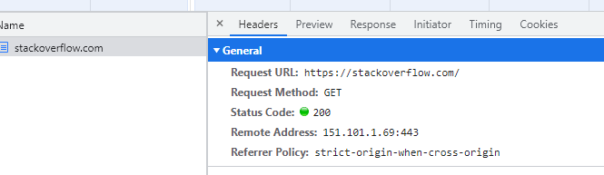
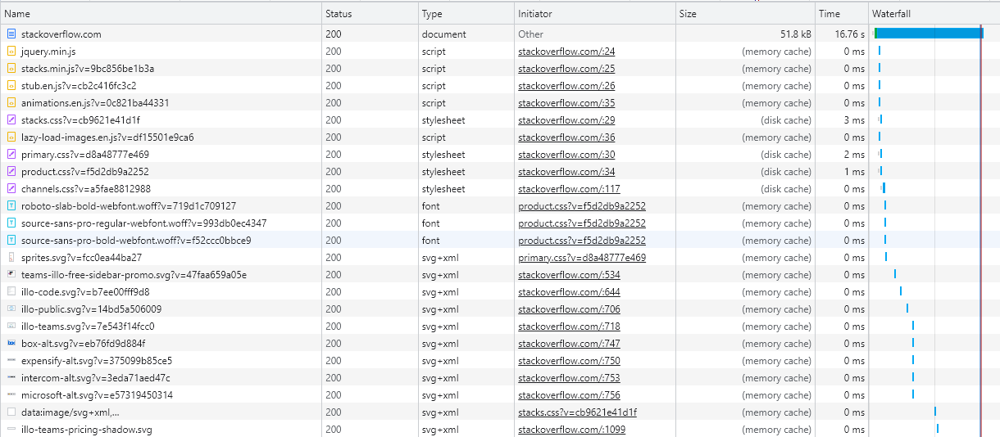
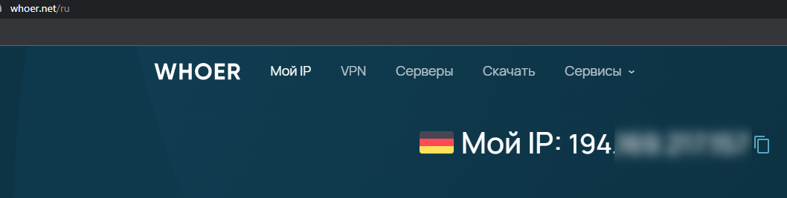

# Домашнее задание к занятию "Компьютерные сети. Лекция 1"

### Цель задания

В результате выполнения этого задания вы: 

1. Научитесь работать с http запросами, чтобы увидеть, как клиенты взаимодействуют с серверами по этому протоколу
2. Поработаете с сетевыми утилитами, чтобы разобраться, как их можно использовать для отладки сетевых запросов, соединений.

### Чеклист готовности к домашнему заданию

1. Убедитесь, что у вас установлены необходимые сетевые утилиты - dig, traceroute, mtr, telnet.
2. Используйте `apt install` для установки пакетов


### Инструкция к заданию

1. Создайте .md-файл для ответов на задания в своём репозитории, после выполнения, прикрепите ссылку на него в личном кабинете.
2. Любые вопросы по выполнению заданий спрашивайте в чате учебной группы и/или в разделе “Вопросы по заданию” в личном кабинете.


### Инструменты/ дополнительные материалы, которые пригодятся для выполнения задания

1. Полезным дополнением к обозначенным выше утилитам будет пакет net-tools. Установить его можно с помощью команды `apt install net-tools`.
2. RFC протокола HTTP/1.0, в частности [страница с кодами ответа](https://www.rfc-editor.org/rfc/rfc1945#page-32).
3. [Ссылки на остальные RFC для HTTP](https://blog.cloudflare.com/cloudflare-view-http3-usage/).

------

## Задание

1. Работа c HTTP через телнет.
- Подключитесь утилитой телнет к сайту stackoverflow.com
  `telnet stackoverflow.com 80`
- Отправьте HTTP запрос
```bash
GET /questions HTTP/1.0
HOST: stackoverflow.com
[press enter]
[press enter]
```
Ответ:
```shell
root@sysadm-fs:/home/vagrant# telnet stackoverflow.com 80
Trying 151.101.129.69...
Connected to stackoverflow.com.
Escape character is '^]'.
GET /questions HTTP/1.0
HOST: stackoverflow.com

HTTP/1.1 403 Forbidden
Connection: close
Content-Length: 1923
Server: Varnish
Retry-After: 0
Content-Type: text/html
Accept-Ranges: bytes
Date: Fri, 27 Jan 2023 04:52:37 GMT
Via: 1.1 varnish
X-Served-By: cache-bma1672-BMA
X-Cache: MISS
X-Cache-Hits: 0
X-Timer: S1674795158.830503,VS0,VE1
X-DNS-Prefetch-Control: off

<!DOCTYPE html>
<html>
<head>
    <meta http-equiv="Content-Type" content="text/html; charset=UTF-8" />
    <title>Forbidden - Stack Exchange</title>

```

*В ответе укажите полученный HTTP код, что он означает?*
Ответ:
```shell
403 Forbidden

   The server understood the request, but is refusing to fulfill it.
   Authorization will not help and the request should not be repeated.
   If the request method was not HEAD and the server wishes to make
   public why the request has not been fulfilled, it should describe
   the reason for the refusal in the entity body. This status code is
   commonly used when the server does not wish to reveal exactly why
   the request has been refused, or when no other response is
   applicable.

```

2. Повторите задание 1 в браузере, используя консоль разработчика F12.
- откройте вкладку `Network`
- отправьте запрос http://stackoverflow.com
- найдите первый ответ HTTP сервера, откройте вкладку `Headers`
- укажите в ответе полученный HTTP код
- проверьте время загрузки страницы, какой запрос обрабатывался дольше всего?
- приложите скриншот консоли браузера в ответ.

Ответы:
Код 200 - открылся успешно 


Запрос stackoverflow дольше всего 



3. Какой IP адрес у вас в интернете?


   
4. Какому провайдеру принадлежит ваш IP адрес? Какой автономной системе AS? Воспользуйтесь утилитой `whois`
root@sysadm-fs:~# whois 194.XXX.XXX.XXX |grep AS
origin:         AS206092

Провайдер
org-name:       Netuity Networks Sp. z o.o.


5. Через какие сети проходит пакет, отправленный с вашего компьютера на адрес 8.8.8.8? Через какие AS? Воспользуйтесь утилитой `traceroute`
У меня вот так отрабатывает traceroute, смысл понятен и что там смотреть тоже 
```shell
root@sysadm-fs:~# traceroute -An 8.8.8.8
traceroute to 8.8.8.8 (8.8.8.8), 30 hops max, 60 byte packets
 1  10.0.2.2 [*]  0.086 ms  0.068 ms  0.064 ms
 2  * * *
 3  * * *
 4  * * *
 5  * * *
 6  * * *
 7  * * *
 8  * * *
 9  * * *
10  * * *
11  * * *
12  * * *
13  * * *
14  * * *
15  * * *
16  * * *
17  * * *
18  * * *
19  * * *
20  * * *
21  * * *
22  * * *
23  * * *
24  * * *
25  * * *
26  * * *
27  * * *
28  * * *
29  * * *
30  * * *
```

6. Повторите задание 5 в утилите `mtr`. На каком участке наибольшая задержка - delay?
Задержек нет, ничего не теряется смотрю на столбец Loss%, цифры постоянно меняются в столбце Last пока работает mtr
Если смотреть в конкретный момент времени, то можно предположить что самое большое время пинга на AS206092
* XXX - это сам убрал некоторые IP б так как всё это на github потом будет выложено 
```shell
apt install mtr
mtr -zn 8.8.8.8
sysadm-fs (10.0.2.15)                                                                                                           2023-01-27T18:32:10+0000
Keys:  Help   Display mode   Restart statistics   Order of fields   quit
                                                                                                                Packets               Pings
 Host                                                                                                         Loss%   Snt   Last   Avg  Best  Wrst StDev
 1. AS???    10.0.2.2                                                                                          0.0%     9    0.4   0.5   0.3   0.7   0.1
 2. (waiting for reply)
 3. AS206092 194.169.XXX.XXX                                                                                   0.0%     9   78.9 111.3  72.3 224.7  52.5
 4. AS60068  185.229.XXX.XXX                                                                                   0.0%     9   76.1  81.5  71.6 127.4  17.6
 5. AS201011 5.56.19.XXX                                                                                        0.0%     9   76.3  87.5  70.7 154.4  27.4
 6. AS201011 80.255.14.5                                                                                       0.0%     8   75.0  78.8  70.7  94.5   8.8
 7. AS15169  72.14.209.160                                                                                     0.0%     8   83.2  89.7  83.1 118.5  11.8
 8. AS15169  142.251.65.131                                                                                    0.0%     8   83.8 100.0  83.8 157.2  23.9
 9. AS15169  142.250.225.77                                                                                    0.0%     8   85.6  93.3  82.0 158.8  26.5
10. AS15169  8.8.8.8                                                                                           0.0%     8   93.2  94.6  82.4 116.2  13.8
```

8. Какие DNS сервера отвечают за доменное имя dns.google? Какие A записи? Воспользуйтесь утилитой `dig`
```shell
root@sysadm-fs:~# dig NS dns.google

; <<>> DiG 9.16.1-Ubuntu <<>> NS dns.google
;; global options: +cmd
;; Got answer:
;; ->>HEADER<<- opcode: QUERY, status: NOERROR, id: 28026
;; flags: qr rd ra; QUERY: 1, ANSWER: 4, AUTHORITY: 0, ADDITIONAL: 1

;; OPT PSEUDOSECTION:
; EDNS: version: 0, flags:; udp: 65494
;; QUESTION SECTION:
;dns.google.                    IN      NS

;; ANSWER SECTION:
dns.google.             21600   IN      NS      ns1.zdns.google.
dns.google.             21600   IN      NS      ns4.zdns.google.
dns.google.             21600   IN      NS      ns2.zdns.google.
dns.google.             21600   IN      NS      ns3.zdns.google.

;; Query time: 111 msec
;; SERVER: 127.0.0.53#53(127.0.0.53)
;; WHEN: Fri Jan 27 18:38:02 UTC 2023
;; MSG SIZE  rcvd: 116
```

```shell
root@sysadm-fs:~# dig A dns.google

; <<>> DiG 9.16.1-Ubuntu <<>> A dns.google
;; global options: +cmd
;; Got answer:
;; ->>HEADER<<- opcode: QUERY, status: NOERROR, id: 23179
;; flags: qr rd ra; QUERY: 1, ANSWER: 2, AUTHORITY: 0, ADDITIONAL: 1

;; OPT PSEUDOSECTION:
; EDNS: version: 0, flags:; udp: 65494
;; QUESTION SECTION:
;dns.google.                    IN      A

;; ANSWER SECTION:
dns.google.             3483    IN      A       8.8.4.4
dns.google.             3483    IN      A       8.8.8.8

;; Query time: 75 msec
;; SERVER: 127.0.0.53#53(127.0.0.53)
;; WHEN: Fri Jan 27 18:38:58 UTC 2023
;; MSG SIZE  rcvd: 71
```

9. Проверьте PTR записи для IP адресов из задания 7. Какое доменное имя привязано к IP? Воспользуйтесь утилитой `dig`

```shell
root@sysadm-fs:~# dig -x 8.8.8.8

; <<>> DiG 9.16.1-Ubuntu <<>> -x 8.8.8.8
;; global options: +cmd
;; Got answer:
;; ->>HEADER<<- opcode: QUERY, status: NOERROR, id: 22703
;; flags: qr rd ra; QUERY: 1, ANSWER: 1, AUTHORITY: 0, ADDITIONAL: 1

;; OPT PSEUDOSECTION:
; EDNS: version: 0, flags:; udp: 65494
;; QUESTION SECTION:
;8.8.8.8.in-addr.arpa.          IN      PTR

;; ANSWER SECTION:
8.8.8.8.in-addr.arpa.   7098    IN      PTR     dns.google.
```
Ответ:
dns.google.