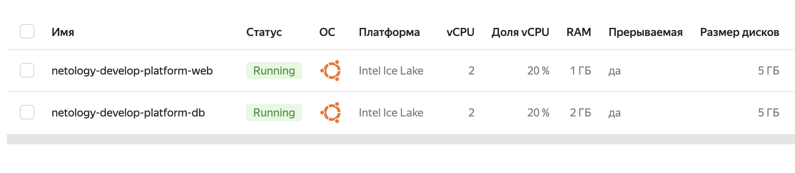

# Домашнее задание к занятию «Основы Terraform. Yandex Cloud»

### Цели задания

1. Создать свои ресурсы в облаке Yandex Cloud с помощью Terraform.
2. Освоить работу с переменными Terraform.


### Чек-лист готовности к домашнему заданию

1. Зарегистрирован аккаунт в Yandex Cloud. Использован промокод на грант.
Ответ:
Готово

2. Установлен инструмент Yandex CLI.
Ответ:
Сделано по инструкции с яндекса

3. Исходный код для выполнения задания расположен в директории [**02/src**](https://github.com/netology-code/ter-homeworks/tree/main/02/src).


### Задание 0

1. Ознакомьтесь с [документацией к security-groups в Yandex Cloud](https://cloud.yandex.ru/docs/vpc/concepts/security-groups?from=int-console-help-center-or-nav).
2. Запросите preview-доступ к этому функционалу в личном кабинете Yandex Cloud. Обычно его выдают в течение 24-х часов.
https://console.cloud.yandex.ru/folders/<ваш cloud_id>/vpc/security-groups.   
Этот функционал понадобится к следующей лекции. 


### Задание 1
В качестве ответа всегда полностью прикладывайте ваш terraform-код в git.

1. Изучите проект. В файле variables.tf объявлены переменные для Yandex provider.

Ответ:

Сгенерировал и добавил свой ключ

2. Переименуйте файл personal.auto.tfvars_example в personal.auto.tfvars. Заполните переменные: идентификаторы облака, токен доступа. Благодаря .gitignore этот файл не попадёт в публичный репозиторий. **Вы можете выбрать иной способ безопасно передать секретные данные в terraform.**

Ответ:

Сделано


3. Сгенерируйте или используйте свой текущий ssh-ключ. Запишите его открытую часть в переменную **vms_ssh_root_key**.

Ответ 

сгенерировал при помощи команды

4. Инициализируйте проект, выполните код. Исправьте намеренно допущенные синтаксические ошибки. Ищите внимательно, посимвольно. Ответьте, в чём заключается их суть.

Ответ:

```sh
rpc error: code = FailedPrecondition desc = Platform "standart-v4" not found
```
Отсутствует такая платформа у провайдера, я выбрал версию  v3

Потом были ошибки по поводу того какие значение правильные для платформы стандарта v3  

Наппример для core fractions такие верные:
```sh
platform "standard-v3"; allowed core fractions: 20, 50, 100
```
Подробнее про платформы:
https://cloud.yandex.ru/docs/compute/concepts/vm-platforms

Конечный результат вот такой 

```sh
  resources {
    cores         = 2
    memory        = 1
    core_fraction = 20
  }
```
`core_fraction` - это параметр, который указывает долю ядер процессора, выделенных для использования определенным ресурсом. 
`cores` - количество ядер, не стал давать много чтобы меньше потратить денег
`memory` - количества памяти, не стал давать много , чтобы меньше потратить денег


Результат:

```sh
yandex_compute_instance.platform: Creation complete after 44s [id=fhmj0ptfa26uqeajt68f]
Apply complete! Resources: 1 added, 0 changed, 0 destroyed.
```


5. Ответьте, как в процессе обучения могут пригодиться параметры ```preemptible = true``` и ```core_fraction=5``` в параметрах ВМ. Ответ в документации Yandex Cloud.

В качестве решения приложите:

- скриншот ЛК Yandex Cloud с созданной ВМ;

Ответ:
Привожу фрагмент своего tfstate   где ВМ со статусом ready

```sh
{
  "version": 4,
  "terraform_version": "1.5.6",
  "serial": 17,
  "lineage": "d4aaca37-c72b-47a6-a7eb-bcf70979fec3",
  "outputs": {},
  "resources": [
    {
      "mode": "data",
      "type": "yandex_compute_image",
      "name": "ubuntu",
      "provider": "provider[\"registry.terraform.io/yandex-cloud/yandex\"]",
      "instances": [
        {
          "schema_version": 0,
          "attributes": {
            "created_at": "2023-09-04T10:53:31Z",
            "description": "ubuntu 20.04 lts",
            "family": "ubuntu-2004-lts",
            "folder_id": "standard-images",
            "id": "fd81n0sfjm6d5nq6l05g",
            "image_id": "fd81n0sfjm6d5nq6l05g",
            "labels": {},
            "min_disk_size": 5,
            "name": "ubuntu-20-04-lts-v20230904",
            "os_type": "linux",
            "pooled": true,
            "product_ids": [
              "f2erpli2oqoo2av4k5g8"
            ],
            "size": 4,
            "status": "ready"
          },
          "sensitive_attributes": []
        }
      ]
    },
```

- скриншот успешного подключения к консоли ВМ через ssh. К OS ubuntu необходимо подключаться под пользователем ubuntu: "ssh ubuntu@vm_ip_address";

Подключился испльзуя сгенерированный приватный ключ , под x - скрыл критичные данные (свой айпи ) и юзера в маке

```sh
xxx@xxx ~ % ssh ubuntu@158.160.114.136 -i ~/.ssh/id_ed25519
Welcome to Ubuntu 20.04.6 LTS (GNU/Linux 5.4.0-159-generic x86_64)

 * Documentation:  https://help.ubuntu.com
 * Management:     https://landscape.canonical.com
 * Support:        https://ubuntu.com/advantage
New release '22.04.3 LTS' available.
Run 'do-release-upgrade' to upgrade to it.

Last login: Fri Sep  8 04:15:32 2023 from xxx.xxx.xxx.xxx
To run a command as administrator (user "root"), use "sudo <command>".
See "man sudo_root" for details.
```


- ответы на вопросы.

Остальыне ответы:
Находится здесь:
https://cloud.yandex.ru/docs/compute/operations/vm-create/create-preemptible-vm


```sh
Прерываемые виртуальные машины — это виртуальные машины, которые могут быть принудительно остановлены в любой момент. Это может произойти в двух случаях:

Если с момента запуска виртуальной машины прошло 24 часа.
Если возникнет нехватка ресурсов для запуска обычной виртуальной машины в той же зоне доступности. Вероятность такого события низкая, но может меняться изо дня в день.
Прерываемые виртуальные машины доступны по более низкой цене в сравнении с обычными, однако не обеспечивают отказоустойчивости.
```
То есть для меня , это более дешевая машина должна быть , самое то для обучения и у меня нет критичных данных

`core_fraction` - это параметр, который указывает долю ядер процессора, выделенных для использования определенным ресурсом. 
У меня ресурсу выделено 2 ядра и 1 единица памяти, а `core_fraction` равен 20, что означает, что ресурс будет использовать 20% выделенного ядра процессора. Это может быть полезно для более точного управления и распределения ресурсов между различными задачами или программами.


### Задание 2

1. Изучите файлы проекта.

Ответ:

Изучил


2. Замените все хардкод-**значения** для ресурсов **yandex_compute_image** и **yandex_compute_instance** на **отдельные** переменные. К названиям переменных ВМ добавьте в начало префикс **vm_web_** .  Пример: **vm_web_name**.

Ответ:
Заменил 

Фрагмент кода:
```sh

data "yandex_compute_image" "ubuntu" {
  family =  var.vm_web_ubuntu_family
}

resource "yandex_compute_instance" "platform" {
  name        =  var.vm_web_name
  platform_id = var.vm_web_platform_id
  resources {
    cores         = var.vm_web_cores
    memory        = var.vm_web_memory
    core_fraction = var.vm_web_core_fraction
  }
```

Фрагмент переменных:

```sh

variable "vm_web_platform_id" {
  type = string
  default = "standard-v3"
}

variable "vm_web_cores" {
  type = number
  default = 2
}

```

2. Объявите нужные переменные в файле variables.tf, обязательно указывайте тип переменной. Заполните их **default** прежними значениями из main.tf. 

Ответ: 

Сделано

3. Проверьте terraform plan. Изменений быть не должно. 

Ответ:

Проверил, заново создал, все отлично

### Задание 3

1. Создайте в корне проекта файл 'vms_platform.tf' . Перенесите в него все переменные первой ВМ.

2. Скопируйте блок ресурса и создайте с его помощью вторую ВМ в файле main.tf: **"netology-develop-platform-db"** ,  cores  = 2, memory = 2, core_fraction = 20. Объявите её переменные с префиксом **vm_db_** в том же файле ('vms_platform.tf').
3. Примените изменения.

Ответ:

Сделано 




### Задание 4

1. Объявите в файле outputs.tf output типа map, содержащий { instance_name = external_ip } для каждой из ВМ.
2. Примените изменения.

В качестве решения приложите вывод значений ip-адресов команды ```terraform output```.

```sh
vm_external_ip_address = {
  "ip_db" = "158.160.111.158"
  "ip_web" = "158.160.62.229"
}
```

### Задание 5

1. В файле locals.tf опишите в **одном** local-блоке имя каждой ВМ, используйте интерполяцию ${..} с несколькими переменными по примеру из лекции.
2. Замените переменные с именами ВМ из файла variables.tf на созданные вами local-переменные.
3. Примените изменения.

Ответ:

Сделал prefix для всех имен своих ВМ

```sh
locals {
    # vm_web_name= "${ var.env }–${ var.project }"
    vm_web_name = "${ var.prefix }-web"
    vm_db_name = "${ var.prefix }-db"
}
```
Исправлениме:

Сделал так , проверил работает 
```sh
locals {
    vm_web_name = "${ var.env }-${ var.project }-web"
    vm_db_name = "${ var.env }-${ var.project }-db"
}
```


### Задание 6

1. Вместо использования трёх переменных  ".._cores",".._memory",".._core_fraction" в блоке  resources {...}, объедините их в переменные типа **map** с именами "vm_web_resources" и "vm_db_resources". В качестве продвинутой практики попробуйте создать одну map-переменную **vms_resources** и уже внутри неё конфиги обеих ВМ — вложенный map.

Ответ: 
Сделал мне немного непонравилось что vscode перестал подсказывать , хотя вроде бы плагин тераформа установлен

```sh
variable "vm_web_resources" {
    default = { 
        family = "ubuntu-2004-lts", 
        platform = "standard-v3", 
        cores = 2,
        memory = 1,
        core_fraction = 20,
    }
}
```
Второй пока не стал трогать , так как будет аналогично тому который выше, хочу посмотреть что с intellesense поразбираться позже
Продвинутую практику тоже не стал делать, так как явно map не очень поддерживается у меня в VSCode , но в целом соглашусь что так задавать переменные проще , короче синтаксис и правильнее объединять нагляднее в map


2. Также поступите с блоком **metadata {serial-port-enable, ssh-keys}**, эта переменная должна быть общая для всех ваших ВМ.

Ответ:

а я ее и так оставил общей в блоке variables


3. Найдите и удалите все более не используемые переменные проекта.
4. Проверьте terraform plan. Изменений быть не должно.

Ответ:
```sh
Terraform has compared your real infrastructure against your configuration and found no differences, so no changes are needed.
```

------

## Дополнительное задание (со звёздочкой*)

**Настоятельно рекомендуем выполнять все задания со звёздочкой.**   
Они помогут глубже разобраться в материале. Задания со звёздочкой дополнительные, не обязательные к выполнению и никак не повлияют на получение вами зачёта по этому домашнему заданию. 

### Задание 7*

Изучите содержимое файла console.tf. Откройте terraform console, выполните следующие задания: 

1. Напишите, какой командой можно отобразить **второй** элемент списка test_list.
2. Найдите длину списка test_list с помощью функции length(<имя переменной>).
3. Напишите, какой командой можно отобразить значение ключа admin из map test_map.
4. Напишите interpolation-выражение, результатом которого будет: "John is admin for production server based on OS ubuntu-20-04 with X vcpu, Y ram and Z virtual disks", используйте данные из переменных test_list, test_map, servers и функцию length() для подстановки значений.

В качестве решения предоставьте необходимые команды и их вывод.

------
### Правила приёма работы

В git-репозитории, в котором было выполнено задание к занятию «Введение в Terraform», создайте новую ветку terraform-02, закоммитьте в эту ветку свой финальный код проекта. Ответы на задания и необходимые скриншоты оформите в md-файле в ветке terraform-02.

В качестве результата прикрепите ссылку на ветку terraform-02 в вашем репозитории.

**Важно. Удалите все созданные ресурсы**.


### Критерии оценки

Зачёт ставится, если:

* выполнены все задания,
* ответы даны в развёрнутой форме,
* приложены соответствующие скриншоты и файлы проекта,
* в выполненных заданиях нет противоречий и нарушения логики.

На доработку работу отправят, если:

* задание выполнено частично или не выполнено вообще,
* в логике выполнения заданий есть противоречия и существенные недостатки. 
