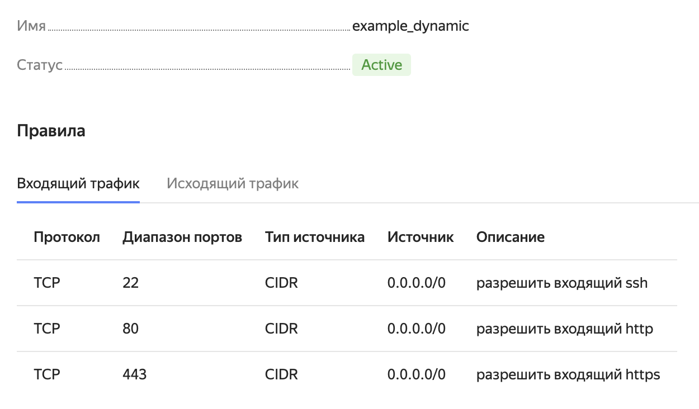
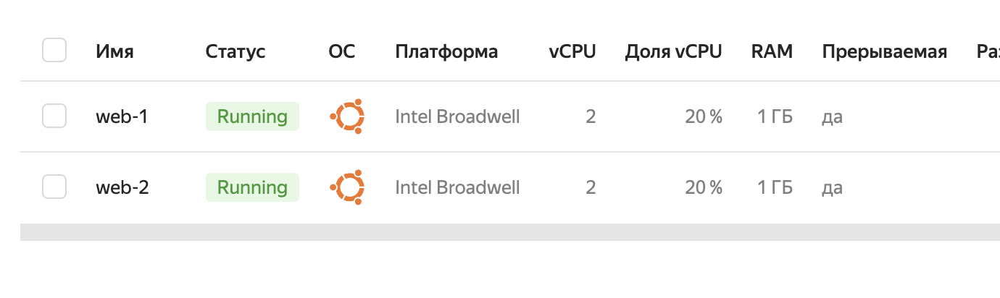
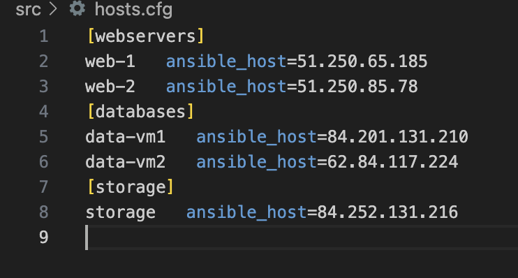

# Домашнее задание к занятию «Управляющие конструкции в коде Terraform»

### Цели задания

1. Отработать основные принципы и методы работы с управляющими конструкциями Terraform.
2. Освоить работу с шаблонизатором Terraform (Interpolation Syntax).

------

### Чек-лист готовности к домашнему заданию

1. Зарегистрирован аккаунт в Yandex Cloud. Использован промокод на грант.
2. Установлен инструмент Yandex CLI.
3. Доступен исходный код для выполнения задания в директории [**03/src**](https://github.com/netology-code/ter-homeworks/tree/main/03/src).
4. Любые ВМ, использованные при выполнении задания, должны быть прерываемыми, для экономии средств.

------

### Инструменты и дополнительные материалы, которые пригодятся для выполнения задания

1. [Консоль управления Yandex Cloud](https://console.cloud.yandex.ru/folders/<cloud_id>/vpc/security-groups).
2. [Группы безопасности](https://cloud.yandex.ru/docs/vpc/concepts/security-groups?from=int-console-help-center-or-nav).
3. [Datasource compute disk](https://terraform-eap.website.yandexcloud.net/docs/providers/yandex/d/datasource_compute_disk.html).


### Задание 1

1. Изучите проект.
2. Заполните файл personal.auto.tfvars.
3. Инициализируйте проект, выполните код. Он выполнится, даже если доступа к preview нет.

Примечание. Если у вас не активирован preview-доступ к функционалу «Группы безопасности» в Yandex Cloud, запросите доступ у поддержки облачного провайдера. Обычно его выдают в течение 24-х часов.

Приложите скриншот входящих правил «Группы безопасности» в ЛК Yandex Cloud или скриншот отказа в предоставлении доступа к preview-версии.

Ответ:




------

### Задание 2

1. Создайте файл count-vm.tf. Опишите в нём создание двух **одинаковых** ВМ  web-1 и web-2 (не web-0 и web-1) с минимальными параметрами, используя мета-аргумент **count loop**. Назначьте ВМ созданную в первом задании группу безопасности.(как это сделать узнайте в документации провайдера yandex/compute_instance )

Ответ:

Готово




2. Создайте файл for_each-vm.tf. Опишите в нём создание двух ВМ с именами "main" и "replica" **разных** по cpu/ram/disk , используя мета-аргумент **for_each loop**. Используйте для обеих ВМ одну общую переменную типа list(object({ vm_name=string, cpu=number, ram=number, disk=number  })). При желании внесите в переменную все возможные параметры.

Ответ:

Фрагмент как заюзал for_each
```sh

resource "yandex_compute_instance" "web" {
  for_each = var.vm_web_resources
  name        = "web-foreach-example-${each.key}"
  platform_id = "standard-v1"
  

  resources {
    cores  = "${each.value.cores}"
    memory = "${each.value.memory}"
    core_fraction = "${each.value.core_fraction}"
  }
```

Переменную вот так объявил то есть я имя машины (часть имени) зашил в ключ и использую key при создании имени машины:
```sh

variable "vm_web_resources" {
  default = {
    vm1 = {
      cores = 2,
      memory = 1,
      core_fraction = 20,
    },
    vm2 = {
      cores = 4,
      memory = 2,
      core_fraction = 5,
    },
  }
}
```


3. ВМ из пункта 2.2 должны создаваться после создания ВМ из пункта 2.1.

Ответ: 
Все создается 

4. Используйте функцию file в local-переменной для считывания ключа ~/.ssh/id_rsa.pub и его последующего использования в блоке metadata, взятому из ДЗ 2.


Пытался в local сделать вот так , не получилось вышла ошибка что нельзя вызывать file

```sh
variable "ssh_pub_key" {
  type    = string
  default = file("~/.ssh/id_rsa.pub")
}
```
Поэтому сделал вот так 
```sh
  metadata = {
    ssh-keys = "ubuntu:${file("~/.ssh/id_rsa.pub")}"
  }
```


Сделал вот так и проверил что те машины которые создаются через for_each доступны по моему публичному ключу (то есть помимо ed ключа) 

Исправление:

Поправил locals корректно 

```sh
locals {
  ssh_pub_key = "ubuntu:${file("~/.ssh/id_rsa.pub")}"
}
```

5. Инициализируйте проект, выполните код.

Ответ:
Все файлы лежат в репе , все работает , создаст 4 ВМ две через count , 2 через for_each

------

### Задание 3

1. Создайте 3 одинаковых виртуальных диска размером 1 Гб с помощью ресурса yandex_compute_disk и мета-аргумента count в файле **disk_vm.tf** .

Ответ:
Создал и вывел айдишники 

```sh
resource "yandex_compute_disk" "virtual_disk" {
  count         = 3
  name          = "my-virtual-disk-${count.index}"
  size          = 1
}

output "disk_ids" {
  value = yandex_compute_disk.virtual_disk[*].id
}
```

```sh

Outputs:

disk_ids = [
  "fhmo69tb0l71tjg2lf5m",
  "fhm5ef16im1vt89jsc4e",
  "fhm149brhhvpsvjctfsp",
]
```


2. Создайте в том же файле одну ВМ c именем "storage" . Используйте блок **dynamic secondary_disk{..}** и мета-аргумент for_each для подключения созданных вами дополнительных дисков.

Ответ:

Все получилось , вот такой блок dynamic 

```sh
  dynamic "secondary_disk" {
    for_each = yandex_compute_disk.virtual_disk[*]
    content {
      device_name = "disk-${secondary_disk.key+1}"
      disk_id     = secondary_disk.value.id
    }
  }
```


------

### Задание 4

1. В файле ansible.tf создайте inventory-файл для ansible.
Используйте функцию tepmplatefile и файл-шаблон для создания ansible inventory-файла из лекции.
Готовый код возьмите из демонстрации к лекции [**demonstration2**](https://github.com/netology-code/ter-homeworks/tree/main/03/demonstration2).
Передайте в него в качестве переменных группы виртуальных машин из задания 2.1, 2.2 и 3.2, т. е. 5 ВМ.

Ответ:
```sh
resource "local_file" "hosts_cfg" {
  content = templatefile("${path.module}/hosts.tftpl",

    { webservers =  yandex_compute_instance.example    }  )

  filename = "${abspath(path.module)}/hosts.cfg"
}

```


2. Инвентарь должен содержать 3 группы [webservers], [databases], [storage] и быть динамическим, т. е. обработать как группу из 2-х ВМ, так и 999 ВМ.
4. Выполните код. Приложите скриншот получившегося файла. 

Ответ:



Для общего зачёта создайте в вашем GitHub-репозитории новую ветку terraform-03. Закоммитьте в эту ветку свой финальный код проекта, пришлите ссылку на коммит.   
**Удалите все созданные ресурсы**.

------

## Дополнительные задания (со звездочкой*)

**Настоятельно рекомендуем выполнять все задания со звёздочкой.** Они помогут глубже разобраться в материале.   
Задания со звёздочкой дополнительные, не обязательные к выполнению и никак не повлияют на получение вами зачёта по этому домашнему заданию. 

### Задание 5* (необязательное)
1. Напишите output, который отобразит все 5 созданных ВМ в виде списка словарей:
``` 
[
 {
  "name" = 'имя ВМ1'
  "id"   = 'идентификатор ВМ1'
  "fqdn" = 'Внутренний FQDN ВМ1'
 },
 {
  "name" = 'имя ВМ2'
  "id"   = 'идентификатор ВМ2'
  "fqdn" = 'Внутренний FQDN ВМ2'
 },
 ....
]
```
Приложите скриншот вывода команды ```terrafrom output```.

------

### Задание 6* (необязательное)

1. Используя null_resource и local-exec, примените ansible-playbook к ВМ из ansible inventory-файла.
Готовый код возьмите из демонстрации к лекции [**demonstration2**](https://github.com/netology-code/ter-homeworks/tree/main/demonstration2).
3. Дополните файл шаблон hosts.tftpl. 
Формат готового файла:
```netology-develop-platform-web-0   ansible_host="<внешний IP-address или внутренний IP-address если у ВМ отсутвует внешний адрес>"```

Для проверки работы уберите у ВМ внешние адреса. Этот вариант используется при работе через bastion-сервер.
Для зачёта предоставьте код вместе с основной частью задания.

### Правила приёма работы

В своём git-репозитории создайте новую ветку terraform-03, закоммитьте в эту ветку свой финальный код проекта. Ответы на задания и необходимые скриншоты оформите в md-файле в ветке terraform-03.

В качестве результата прикрепите ссылку на ветку terraform-03 в вашем репозитории.

Важно. Удалите все созданные ресурсы.

### Критерии оценки

Зачёт ставится, если:

* выполнены все задания,
* ответы даны в развёрнутой форме,
* приложены соответствующие скриншоты и файлы проекта,
* в выполненных заданиях нет противоречий и нарушения логики.

На доработку работу отправят, если:

* задание выполнено частично или не выполнено вообще,
* в логике выполнения заданий есть противоречия и существенные недостатки. 


