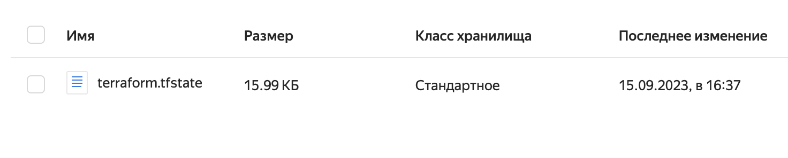

# Домашнее задание к занятию «Использование Terraform в команде»

### Цели задания

1. Научиться использовать remote state.
2. Освоить приёмы командной работы.


### Чек-лист готовности к домашнему заданию

1. Зарегистрирован аккаунт в Yandex Cloud. Использован промокод на грант.
2. Установлен инструмент Yandex CLI.
3. Любые ВМ, использованные при выполнении задания, должны быть прерываемыми, для экономии средств.

------

### Задание 1

1. Возьмите код:
- из [ДЗ к лекции 4](https://github.com/netology-code/ter-homeworks/tree/main/04/src),
- из [демо к лекции 4](https://github.com/netology-code/ter-homeworks/tree/main/04/demonstration1).
2. Проверьте код с помощью tflint и checkov. Вам не нужно инициализировать этот проект.
3. Перечислите, какие **типы** ошибок обнаружены в проекте (без дублей).


Ответ:
Скачал код, 
Запустил в докере tflint

```sh
docker run --rm -v "$(pwd):/tflint" ghcr.io/terraform-linters/tflint  /tflint
```

Получил ошибку:
```sh
Status: Downloaded newer image for ghcr.io/terraform-linters/tflint:latest
Command line arguments support was dropped in v0.47. Use --chdir or --filter instead.
```

Поэтому использовал другую команду:
```sh
docker run --rm -v "$(pwd):/tflint" ghcr.io/terraform-linters/tflint --chdir=/tflint
```

Типы варнингов без дублей для двух проектов :
```sh
Warning: Missing version constraint for provider "yandex"  
Warning: [Fixable] variable "" is declared but not used
Warning: Module source "git::https://github.com/udjin10/yandex_compute_instance.git?ref=main" uses a default branch as ref (main) 
```


Запустил chekov результат ниже, более качественная проверка :
```sh
docker pull bridgecrew/checkov
docker run --rm --tty --volume $(pwd):/tf --workdir /tf bridgecrew/checkov \
--download-external-modules true --directory /tf
```


Типы ошибок найденные им:

"Ensure compute instance does not have serial console enabled."
"Ensure security group is assigned to network interface."
"Ensure compute instance does not have public IP."
"Ensure Terraform module sources use a commit hash"

Полный вывод себе сохранил сюда:
```sh

       _             _              
   ___| |__   ___  ___| | _______   __
  / __| '_ \ / _ \/ __| |/ / _ \ \ / /
 | (__| | | |  __/ (__|   < (_) \ V / 
  \___|_| |_|\___|\___|_|\_\___/ \_/  
                                      
By bridgecrew.io | version: 2.4.36 

terraform scan results:

Passed checks: 2, Failed checks: 5, Skipped checks: 0

Check: CKV_YC_4: "Ensure compute instance does not have serial console enabled."
	PASSED for resource: module.test-vm.yandex_compute_instance.vm[0]
	File: /.external_modules/github.com/udjin10/yandex_compute_instance/main/main.tf:24-73
	Calling File: /main.tf:32-48
Check: CKV_YC_4: "Ensure compute instance does not have serial console enabled."
	PASSED for resource: module.test-vm.yandex_compute_instance.vm[1]
	File: /.external_modules/github.com/udjin10/yandex_compute_instance/main/main.tf:24-73
	Calling File: /main.tf:32-48
Check: CKV_YC_11: "Ensure security group is assigned to network interface."
	FAILED for resource: module.test-vm.yandex_compute_instance.vm[0]
	File: /.external_modules/github.com/udjin10/yandex_compute_instance/main/main.tf:24-73
	Calling File: /main.tf:32-48

		Code lines for this resource are too many. Please use IDE of your choice to review the file.
Check: CKV_YC_2: "Ensure compute instance does not have public IP."
	FAILED for resource: module.test-vm.yandex_compute_instance.vm[0]
	File: /.external_modules/github.com/udjin10/yandex_compute_instance/main/main.tf:24-73
	Calling File: /main.tf:32-48

		Code lines for this resource are too many. Please use IDE of your choice to review the file.
Check: CKV_YC_11: "Ensure security group is assigned to network interface."
	FAILED for resource: module.test-vm.yandex_compute_instance.vm[1]
	File: /.external_modules/github.com/udjin10/yandex_compute_instance/main/main.tf:24-73
	Calling File: /main.tf:32-48

		Code lines for this resource are too many. Please use IDE of your choice to review the file.
Check: CKV_YC_2: "Ensure compute instance does not have public IP."
	FAILED for resource: module.test-vm.yandex_compute_instance.vm[1]
	File: /.external_modules/github.com/udjin10/yandex_compute_instance/main/main.tf:24-73
	Calling File: /main.tf:32-48

		Code lines for this resource are too many. Please use IDE of your choice to review the file.
Check: CKV_TF_1: "Ensure Terraform module sources use a commit hash"
	FAILED for resource: test-vm
	File: /main.tf:32-48

		32 | module "test-vm" {
		33 |   source          = "git::https://github.com/udjin10/yandex_compute_instance.git?ref=main"
		34 |   env_name        = "develop"
		35 |   network_id      = yandex_vpc_network.develop.id
		36 |   subnet_zones    = ["ru-central1-a"]
		37 |   subnet_ids      = [ yandex_vpc_subnet.develop.id ]
		38 |   instance_name   = "web"
		39 |   instance_count  = 2
		40 |   image_family    = "ubuntu-2004-lts"
		41 |   public_ip       = true
		42 |   
		43 |   metadata = {
		44 |       user-data          = data.template_file.cloudinit.rendered #Для демонстрации №3
		45 |       serial-port-enable = 1
		46 |   }
		47 | 
		48 | }
```


------

### Задание 2

1. Возьмите ваш GitHub-репозиторий с **выполненным ДЗ 4** в ветке 'terraform-04' и сделайте из него ветку 'terraform-05'.

Ответ:
```sh
git branch
git branch terraform-04
git checkout terraform-04
git branch terraform-05
git checkout terraform-05
```


2. Повторите демонстрацию лекции: настройте YDB, S3 bucket, yandex service account, права доступа и мигрируйте state проекта в S3 с блокировками. Предоставьте скриншоты процесса в качестве ответа.

Ответ:
Создал сервисный аккаунт (у каталога) tfstate2 (обязательно надо назначить какую то роль иначе потом он не появляется во вкладке Каталога Права доступ), назначил роль ydb.editor и потом добавил storage.editor

Создал бакет tfstate-develop-my в Object storage yandex 
В ACL бакета назначил tfstate2 права READ и WRITE

Потом создал новый ключ к нему
# Идентификатор ключа
YCAJExxxxx
# Ваш секретный ключ
YCPwTG-Txxxxxxxxx


Инициализировал проект командой

```sh
terraform init -backend-config="access_key=YCAJEscxxxxxxx" -backend-config="secret_key=YCPwTG-TG8xxxxxx"
```
где s3_access_key - это Идентификатор ключа у яндекс
а secret_key - это Ваш секретный ключ
```sh


xxx demonstration1 % terraform init -backend-config="access_key=YCAJEsxxxxx" -backend-config="secret_key=YCPwTG-xxxxxxxxxxx"


Initializing the backend...

Successfully configured the backend "s3"! Terraform will automatically
use this backend unless the backend configuration changes.

```

Результат стейт:



Настройка YDB
Открыл свою YDB , навигация - создать таблицу - tfstate-lock
Один столбец lock_id тип string

Взял endpoint Document который http


Эндпоинт
grpcs://ydb.serverless.yandexcloud.net:2135/?database=/ru-central1/b1grng0r9tbanc9u316l/etn9nuvalxxxx
Document API эндпоинт
https://docapi.serverless.yandexcloud.net/ru-central1/b1grng0r9tbanc9u316l/etn9nxxxx


Добавил ключ: 
```sh
-migrate-state
``` 
и миграция норм 


Также получил вот такую ошибку из за неправильного lock_id -> LockID
Ну я по итогу просто добавил еще один столбец LockID и миграция прошла пофиксилась


```sh
│ Error: Error acquiring the state lock
│ 
│ Error message: 2 errors occurred:
│       * ValidationException: Unsupported API version "" for table "/ru-central1/b1grng0r9tbanc9u316l/etn9nuvalhvt327cbinr/tfstate-lock"
│       status code: 400, request id: 61f005a7-c059-4509-a234-7309a69953d7
│       * ValidationException: Unsupported API version "" for table "/ru-central1/b1grng0r9tbanc9u316l/etn9nuvalhvt327cbinr/tfstate-lock"
│       status code: 400, request id: 484c729c-a17f-4eff-8daa-6253770a5255
```

Читать здесь:
https://cloud.yandex.com/en/docs/tutorials/infrastructure-management/terraform-state-lock
!!!!!!! ОЧЕНЬ Важно чтобы была вот такого типа таблица:
"В параметрах таблицы укажите Тип таблицы — документная таблица."
Об этом в лекциях также указано, но по дефолту создается другая и я пропусти это
Без этого я долго ничего не мог сделать пока не поправил 

3. Закоммитьте в ветку 'terraform-05' все изменения.

Ответ:
Закомитил 

4. Откройте в проекте terraform console, а в другом окне из этой же директории попробуйте запустить terraform apply.
5. Пришлите ответ об ошибке доступа к state.
Ответ:
```sh
Acquiring state lock. This may take a few moments...
╷
│ Error: Error acquiring the state lock
│ 
│ Error message: ConditionalCheckFailedException: Condition not satisfied
│ Lock Info:
│   ID:        0e7654d6-ab16-38b1-cc39-5723d8899edf
│   Path:      state-lock-db/terraform.tfstate
│   Operation: OperationTypeInvalid
│   Who:       ventura@MacBook-Air-ventura.local
│   Version:   1.5.6
│   Created:   2023-09-15 12:57:56.060548 +0000 UTC
│   Info:      

```

6. Принудительно разблокируйте state. Пришлите команду и вывод.

```sh
xxx demonstration1 % terraform force-unlock 0e7654d6-ab16-38b1-cc39-5723d8899edf
Do you really want to force-unlock?
  Terraform will remove the lock on the remote state.
  This will allow local Terraform commands to modify this state, even though it
  may still be in use. Only 'yes' will be accepted to confirm.

  Enter a value: yes

Terraform state has been successfully unlocked!

The state has been unlocked, and Terraform commands should now be able to
obtain a new lock on the remote state.
```

------
### Задание 3  

1. Сделайте в GitHub из ветки 'terraform-05' новую ветку 'terraform-hotfix'.
Ответ:
2. Проверье код с помощью tflint и checkov, исправьте все предупреждения и ошибки в 'terraform-hotfix', сделайте коммит.
Ответ:
Сделал правки по tflint , checkov подвисает в локальном докере , принцип ясен 


3. Откройте новый pull request 'terraform-hotfix' --> 'terraform-05'. 
Ответ:


4. Вставьте в комментарий PR результат анализа tflint и checkov, план изменений инфраструктуры из вывода команды terraform plan.
5. Пришлите ссылку на PR для ревью. Вливать код в 'terraform-05' не нужно.

------
### Задание 4

1. Напишите переменные с валидацией и протестируйте их, заполнив default верными и неверными значениями. Предоставьте скриншоты проверок из terraform console. 

- type=string, description="ip-адрес" — проверка, что значение переменной содержит верный IP-адрес с помощью функций cidrhost() или regex(). Тесты:  "192.168.0.1" и "1920.1680.0.1";
- type=list(string), description="список ip-адресов" — проверка, что все адреса верны. Тесты:  ["192.168.0.1", "1.1.1.1", "127.0.0.1"] и ["192.168.0.1", "1.1.1.1", "1270.0.0.1"].

## Дополнительные задания (со звёздочкой*)

**Настоятельно рекомендуем выполнять все задания со звёздочкой.** Их выполнение поможет глубже разобраться в материале.   
Задания со звёздочкой дополнительные, не обязательные к выполнению и никак не повлияют на получение вами зачёта по этому домашнему заданию. 
------
### Задание 5*
1. Напишите переменные с валидацией:
- type=string, description="любая строка" — проверка, что строка не содержит символов верхнего регистра;
- type=object — проверка, что одно из значений равно true, а второе false, т. е. не допускается false false и true true:
```
variable "in_the_end_there_can_be_only_one" {
    description="Who is better Connor or Duncan?"
    type = object({
        Dunkan = optional(bool)
        Connor = optional(bool)
    })

    default = {
        Dunkan = true
        Connor = false
    }

    validation {
        error_message = "There can be only one MacLeod"
        condition = <проверка>
    }
}
```
------
### Задание 6*

1. Настройте любую известную вам CI/CD-систему. Если вы ещё не знакомы с CI/CD-системами, настоятельно рекомендуем вернуться к этому заданию после изучения Jenkins/Teamcity/Gitlab.
2. Скачайте с её помощью ваш репозиторий с кодом и инициализируйте инфраструктуру.
3. Уничтожьте инфраструктуру тем же способом.


### Правила приёма работы

Ответы на задания и необходимые скриншоты оформите в md-файле в ветке terraform-05.

В качестве результата прикрепите ссылку на ветку terraform-05 в вашем репозитории.

**Важно.** Удалите все созданные ресурсы.

### Критерии оценки

Зачёт ставится, если:

* выполнены все задания,
* ответы даны в развёрнутой форме,
* приложены соответствующие скриншоты и файлы проекта,
* в выполненных заданиях нет противоречий и нарушения логики.

На доработку работу отправят, если:

* задание выполнено частично или не выполнено вообще,
* в логике выполнения заданий есть противоречия и существенные недостатки. 


